# **程序员的基本常识**

## 序言

### 关于唯物辩证法

物质世界是由物质构成的，这“物质”，在我看来包括了能量和物质。但我们所处的世界是由物质世界和主观世界构成的。而计算机就是由客观物质加上人类主观意识创造出的产物，它也是严格遵循客观物质世界的。所以，我认为想要了解计算机就要从它的真实物理构成出发。另外，毛主席说：“理性认识依赖于感性认识，感性认识有待于发展到理性认识，这就是辩证唯物论的认识论”。故，只有实践，更或者是说社会实践，才是检验真理的唯一标准。必须要实践，实践才有出路；抛去实践、现实，就只有死路一条。接下来，会一路从物质世界出发直到一个看似“主观”的计算机世界。

### 关于动机

毛主席曾说：“认识从实践始，经过实践得到了理论的认识，还须再回到实践去。”钱学森说："只要毛泽东思想活着，中国就永远年轻。"在学习了计算机的理论之后，对计算机的实际有更加深入的认识，所以，必须回到实践中，从实践中得到计算机的“真理”。在这个笔记中，将理论与实践的异同进行说明，尽量做到不是写给作者自己看，做到通俗易懂。作者大学四年，学得过于冗杂，包括前后端、嵌入式以及系统软件和基础软件，所以什么都不算精湛，所以这个笔记也算是对这四年的总结吧。另外，作者会用到不是专业领域的术语，我认为这样是不“本本主义”的，尽量通俗易懂的，说人话的。另外，也算是个玩具：主要是像Linux0.01一样作为技术验证。

### 关于观看文档

文档没办法很好地组织（作者是这么认为的），因为一个与硬件结合的子系统，既要看硬件机制，又要看软件设计，所以，作者认为必然不可能组织在一起，为了内容的不重复以及硬件与软件设计的分离，所以就按这个目录安排。不过，作者会在后续修订中，表明各个软件设计背后的硬件机制的位置。

### 关于源码

系统是作者一个人做的，肯定会有繁琐的设计以及运行时未知的bug，请读者指正。linus说过：**"Good programmers write code. Great programmers rewrite code. The best programmers find bugs."**。还请帮帮作者，也帮帮自己。

## 第一章：硬件基础

### 逻辑门

我们常见的逻辑门有与门、或门、非门、与非门、或非门、异或门、同或门、三态门和传输门，它们都是由MOS管构成的。MOS管主要的作用就是电子流动的通断，MOS管又分为PMOS和NMOS。

#### 各门电路真值表

**与门 (AND)**
| 输入A | 输入B | 输出Y |
| :---: | :---: | :---: |
|   0   |   0   |   0   |
|   0   |   1   |   0   |
|   1   |   0   |   0   |
|   1   |   1   |   1   |

**或门 (OR)**
| 输入A | 输入B | 输出Y |
| :---: | :---: | :---: |
|   0   |   0   |   0   |
|   0   |   1   |   1   |
|   1   |   0   |   1   |
|   1   |   1   |   1   |

**非门 (NOT)**
| 输入A | 输入Y |
| :---: | :---: |
|   0   |   1   |
|   1   |   0   |

**与非门 (NAND)**
| 输入A | 输入B | 输出Y |
| :---: | :---: | :---: |
|   0   |   0   |   1   |
|   0   |   1   |   1   |
|   1   |   0   |   1   |
|   1   |   1   |   0   |

**或非门 (NOR)**
| 输入A | 输入B | 输出Y |
| :---: | :---: | :---: |
|   0   |   0   |   1   |
|   0   |   1   |   0   |
|   1   |   0   |   0   |
|   1   |   1   |   0   |

**异或门 (XOR)**
| 输入A | 输入B | 输出Y |
| :---: | :---: | :---: |
|   0   |   0   |   0   |
|   0   |   1   |   1   |
|   1   |   0   |   1   |
|   1   |   1   |   0   |

**同或门 (XNOR)**
| 输入A | 输入B | 输出Y |
| :---: | :---: | :---: |
|   0   |   0   |   1   |
|   0   |   1   |   0   |
|   1   |   0   |   0   |
|   1   |   1   |   1   |

### 用门电路搭建基本原件

#### 译码器

真值表如下：
|  I2  |  I1  |  I0  |  O7  |  O6  |  O5  |  O4  |  O3  |  O2  |  O1  |  O0  |
| :--: | :--: | :--: | :--: | :--: | :--: | :--: | :--: | :--: | :--: | :--: |
|  0   |  0   |  0   |  0   |  0   |  0   |  0   |  0   |  0   |  0   |  0   |
|  0   |  0   |  1   |  0   |  0   |  0   |  0   |  0   |  0   |  1   |  0   |
|  0   |  1   |  0   |  0   |  0   |  0   |  0   |  0   |  1   |  0   |  0   |
|  0   |  1   |  1   |  0   |  0   |  0   |  0   |  1   |  0   |  0   |  0   |
|  1   |  0   |  0   |  0   |  0   |  0   |  1   |  0   |  0   |  0   |  0   |
|  1   |  0   |  1   |  0   |  0   |  1   |  0   |  0   |  0   |  0   |  0   |
|  1   |  1   |  0   |  0   |  1   |  0   |  0   |  0   |  0   |  0   |  0   |
|  1   |  1   |  1   |  1   |  0   |  0   |  0   |  0   |  0   |  0   |  0   |

在我看来，它就是把所有简单情况都预判了，仅此而已。
类比到C语言就是switch或者是多个if。
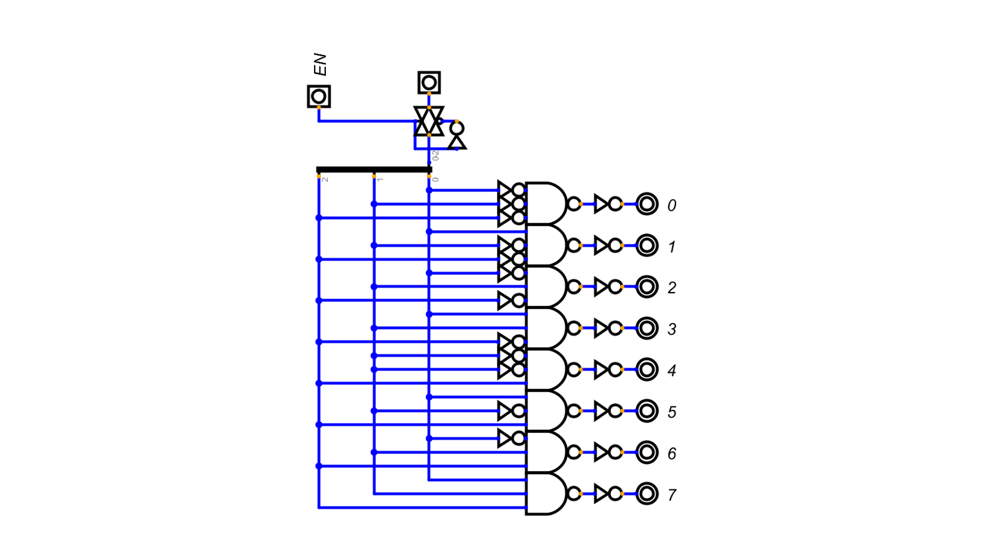
<div align="center">图1-1 3-8译码器</div>
如果把输入扩展到4位，则是4-16译码器。

#### 半加器

真值表如下：
|  A   |  B   |  C   |  S   |
| :--: | :--: | :--: | :--: |
|  0   |  0   |  0   |  0   |
|  0   |  1   |  0   |  1   |
|  1   |  0   |  0   |  1   |
|  1   |  1   |  1   |  0   |

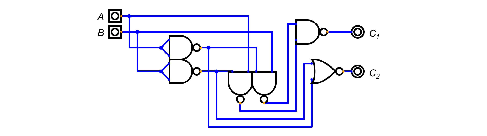
<div align="center">图1-2 半加器</div>
有半加器就可以实现全加器，但为什么要有全加器？因为半加器只是在两位时有本位和进位，对于串行加法器，会有低位向高位的进位，故必须有全加器进行三位的加法。

#### 全加器
真值表如下：
|  A   |  B   |  C   |  C2  |  C1  |
| :--: | :--: | :--: | :--: | :--: |
|  0   |  0   |  0   |  0   |  0   |
|  0   |  0   |  1   |  0   |  1   |
|  0   |  1   |  0   |  0   |  1   |
|  0   |  1   |  1   |  1   |  0   |
|  1   |  0   |  0   |  0   |  1   |
|  1   |  0   |  1   |  1   |  0   |
|  1   |  1   |  0   |  1   |  0   |
|  1   |  1   |  1   |  1   |  1   |

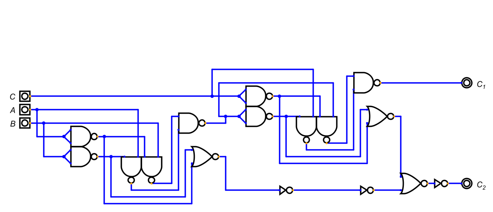
<div align="center">图1-3 全加器</div>

#### D触发器

真值表如下：
| CLK  |  D   | Q（n） | Q（n+1） |
| :--: | :--: | :----: | :------: |
|  ↑   |  0   |   X    |    0     |
|  ↑   |  1   |   X    |    1     |
|  ↓   |  X   |   Q    |    Q     |


<div align="center">图1-4 D触发器</div>

#### 寄存器
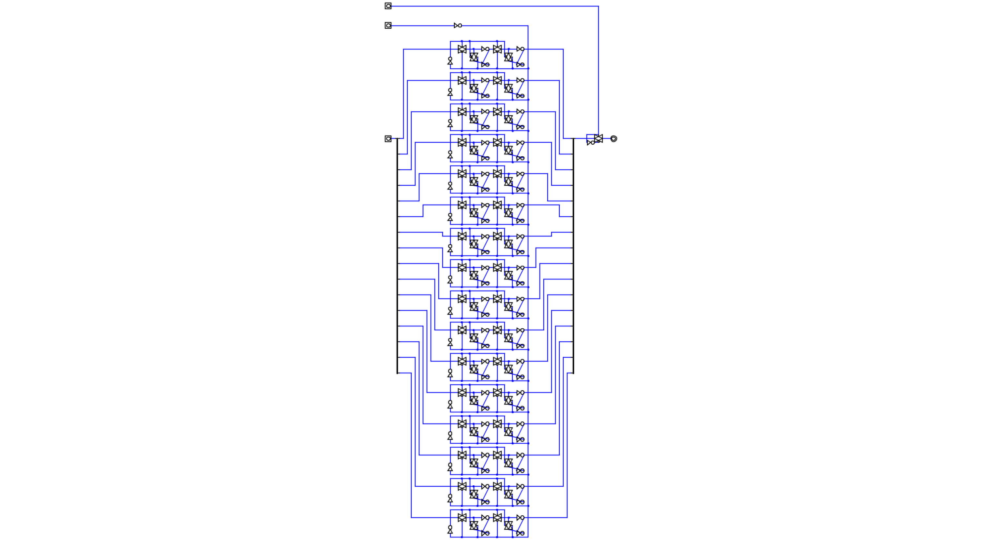
<div align="center">图1-5 寄存器</div>

#### 加法器
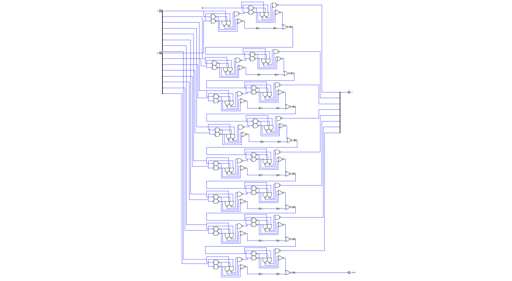
<div align="center">图1-6 加法器</div>

#### 乘法器
这里的乘法器选择半字节乘法器
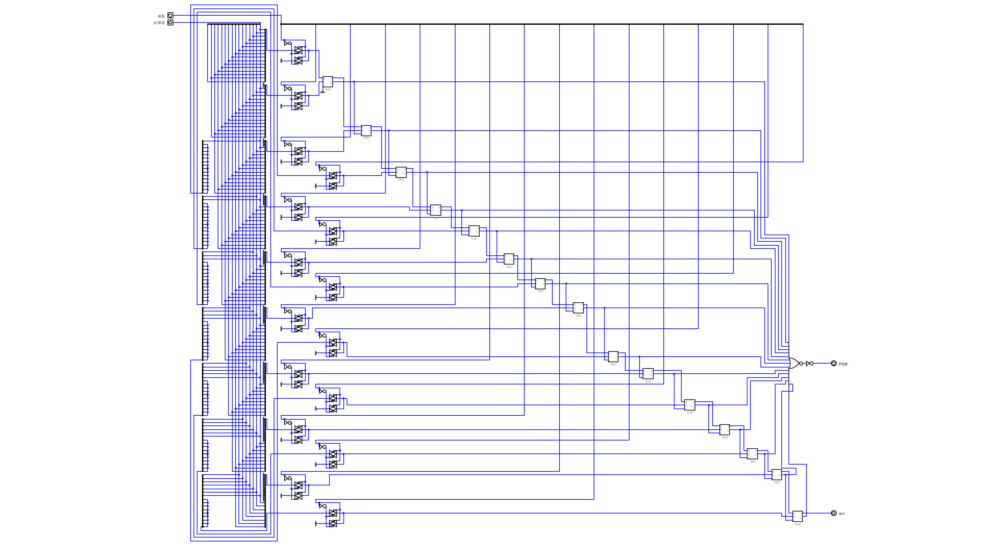
<div align="center">图1-7 乘法器</div>

#### 比较器
单位比较真值表如下：

|  A   |  B   |  >   |  =   |  <   |
| :--: | :--: | :--: | :--: | :--: |
|  0   |  0   |  0   |  1   |  0   |
|  0   |  1   |  0   |  0   |  1   |
|  1   |  0   |  1   |  0   |  0   |
|  1   |  1   |  0   |  1   |  0   |


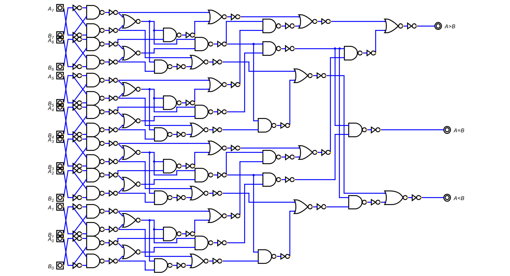
<div align="center">图1-8 比较器</div>

#### 简单ALU
这里认为ALU就是译码器加其它运算电路，具体如下所示：
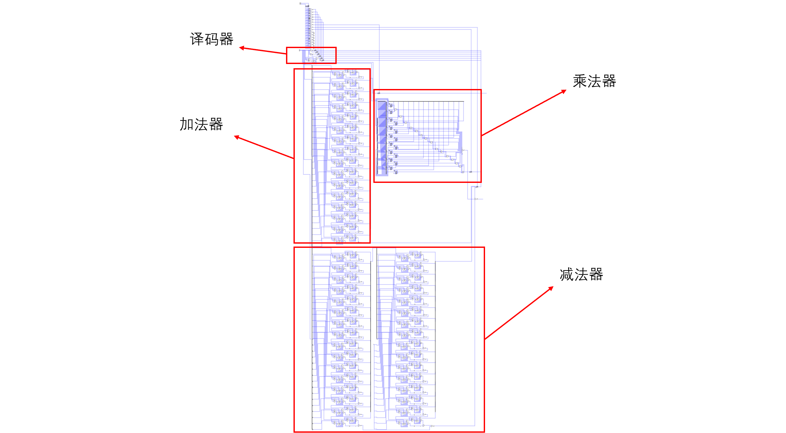
<div align="center">图1-9 ALU</div>
很抱歉，为了能展示更全的结构图，这里牺牲了清晰度。不过，会有Digital的.dig在附录供参考。

#### 玩具CPU
将上述组合起来便是一个可运行的玩具，具体如下所示：
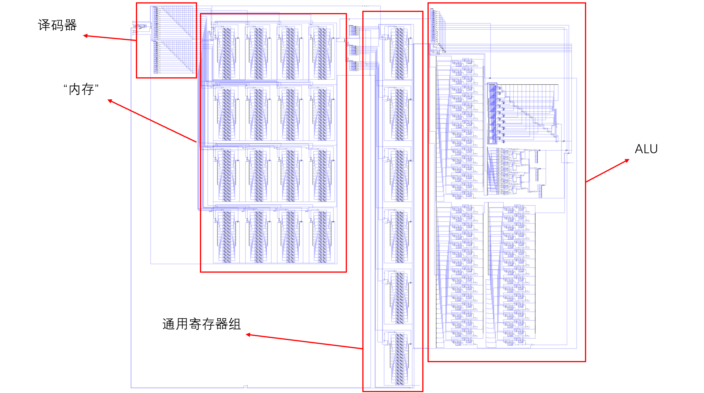

<div align="center">图1-10 玩具CPU</div>
这部分，作者还是不够精通，做完这些之后，再也没碰过数字电路。所以，一定会有很多缺陷，请见谅。

1. 可能有人会问：你的PC（Program Counter）呢？这里，直接采用了从内存0地址（如下所示）顺序执行的方式进行组织，故每次使用这个时，都需要先向“内存”中写入程序，然后才能执行。这里的PC直接使用自增器来代替。而不是像ARM一样有通用寄存器当作PC。
2. “内存”为什么要加双引号？那是因为一般的memory都是DRAM，而这里都是由D触发器构成的内存，严格来说，这里的应该是SRAM。

推荐读者玩《图灵完备》（《Turing Complete》），建议千万不要看攻略，即使设计复杂，也不要看攻略。

### 以CPU为中心的架构

### 以内存为中心的架构

## 第二章：伟大的电气工程师和硬件工程师

### 按下开机键的那一刻
当按下开机键的那一刻，电源会先向主板发送PWROK信号；之后，主板会向CPU发送RESET信号；接下来，CPU会从复位向量（0xfffffff0）处开始取指，开始执行固件代码（BIOS/UEFI），执行上一步的过程中，会由固件进行POST；这样，执行完固件必要操作后就到了MBR或者BOOTX64.EFI；最后，CPU的控制权才交到了系统程序员的手上。

### BIOS
BIOS（Basic Input Output System），这个字眼是在1975年第一次由CP/M操作系统中出现。它是一个固件，是直接焊在主板上的；它提供了进入操作系统前的检测手段和信息收集，这让操作系统开发的初始阶段（在进入内核前）变得简单。它提供了许多函数，例如：对VGA（文本模式）的操作、获取内存布局、读取/写入磁盘等功能。如下，给出了部分BIOS中断服务例程对应的功能表（包含中断号和功能号）。

**BIOS中断服务**
| 中断号 | 功能号（AH） | 功能描述              | 使用情况/说明                                        |
| ------ | ------------ | --------------------- | ---------------------------------------------------- |
| 0x10   | 0x00         | 设置视频模式          | 选择文字或图形模式。                                 |
| 0x10   | 0x01         | 设置光标类型          | 设置光标的开始和结束扫描线。                         |
| 0x10   | 0x02         | 设置光标位置          | 在指定的页上移动光标到某个位置。                     |
| 0x10   | 0x03         | 获取光标位置和类型    | 返回当前光标的位置和形状信息。                       |
| 0x13   | 0x00         | 重置磁盘系统          | 重置磁盘控制器并检查磁盘状态。                       |
| 0x13   | 0x02         | 读取扇区              | 从指定磁盘读取一个或多个扇区到内存中。               |
| 0x13   | 0x03         | 写入扇区              | 将内存中的数据写入指定磁盘的扇区。                   |
| 0x14   | 0x00         | 初始化串口通信        | 初始化指定的串行端口。                               |
| 0x14   | 0x01         | 发送字符到串口        | 向串口发送一个字符。                                 |
| 0x14   | 0x02         | 接收字符              | 从串口接收一个字符。                                 |
| 0x15   | 0x88         | 获取扩展内存大小      | 返回扩展内存的大小（高于1MB的内存）。                |
| 0x15   | 0xE820       | 获取系统内存映射      | 提供详细的内存布局信息（通常用于现代系统引导程序）。 |
| 0x16   | 0x00         | 读取键盘输入          | 获取一个按键的扫描码和 ASCII 码。                    |
| 0x16   | 0x01         | 检查键盘缓冲区        | 检查键盘缓冲区是否有按键输入。                       |
| 0x16   | 0x02         | 获取键盘状态标志      | 返回键盘的状态标志（如 Shift、Ctrl 键是否被按下）。  |
| 0x17   | 0x00         | 初始化打印机          | 初始化并检查打印机状态。                             |
| 0x17   | 0x01         | 发送字符到打印机      | 向并行端口的打印机发送一个字符。                     |
| 0x19   | 无           | 引导加载              | BIOS 加载启动设备上的引导扇区并启动《操作系统》。    |
| 0x1A   | 0x00         | 获取实时时钟时间      | 返回当前的时分秒以及日期。                           |
| 0x1A   | 0x01         | 设置实时时钟时间      | 设置系统时间为指定的时分秒。                         |
| 0x1A   | 0x02         | 获取实时时钟状态      | 检查实时时钟是否处于有效状态。                       |
| 0x05   | 无           | 打印字符到 LPT 并等待 | 向并行端口发送一个字符，并等待打印机处理完成。       |
| 0x12   | 无           | 检测常规内存大小      | 返回系统中常规内存的大小（单位：KB）。               |
| 0x11   | 无           | 获取设备列表          | 检测系统设备（如软驱、硬盘等）的存在情况。           |
| 0x18   | 无           | 空中断服务            | 通常用作保留或默认中断，未执行实际操作。             |
| 0x1C   | 无           | 用户定制定时器中断    | 用户自定义定时操作，通常与系统时钟配合使用。         |
| 0x09   | 无           | 键盘中断              | BIOS 处理按键事件并更新键盘缓冲区。                  |

#### 怎么用这些中断服务例程
请看，它已经叫做中断服务例程，那就只能通过**INT**指令去调用。例如，如果要使用设置视频模式功能时，要提前向ax寄存器的高位ah中写入0x00，地位al中写入模式值，最后，在.asm源文件中写入int 0x10去完成视频模式的设置。（这里不是说写了代码就行，而是说源文件中写，编译后的二进制文件中由对应的机器码；当机器执行到对应位置时，就会进入该功能。）

### UEFI
UEFI（Unified Extensible Firmware Interface）也是一类规范，其实现UEFI固件同BIOS类似，也是把程序直接烧在ROM中的。当按下开机键后，UEFI固件中的代码会被加载到内存中。它主要的功能有以下两种：

#### 必要的解释
```c
EFI_STATUS
EFIAPI
MyBootUefiMain(IN EFI_HANDLE ImageHandle,
               IN EFI_SYSTEM_TABLE *SystemTable)
{
    EFI_STATUS Status = EFI_SUCCESS;
    Print(L"Hello World...\r\n");
    return Status;
}
```
以上的代码是我指定的BOOTX64.EFI的入口函数，应该、大概，程序员们会对入口函数的两个参数有疑问：为什么这两个能直接拿来用？
正常的入口函数不是像：
```c
int mian()
{
    printf("Hello World...\n");
    return 0;
}
```
或者
```java
public class Main {
    public static void main(String[] args) {
        System.out.printf("Hello World...");
    }
}
```
这是因为UEFI规范在编译的过程中，就把对应的地址值传到了相对应的位置（遵循Microsoft x64 calling convention）。所以，便可以直接使用。这样的思路同样可以用在之后我们传BootInfo的过程中，以下是内核代码的传值示意：

```c
void kernel_init(BootInfoHead *Info)
{   
    while (TRUE)
    {
        DEBUG;
    }
}
```

#### UEFI_BOOT_SERVICES
BootServices指的是UEFI启动时服务，是在ExitBootServices()之前能使用的服务。其中，也包括Protocol Services。

##### 使用到的BootServices服务
1. **GetMemoryMap()**

   - 五个参数（从上到下）：

     |              参数及其类型               |                             作用                             |
     | :-------------------------------------: | :----------------------------------------------------------: |
     |       IN OUT UINTN *MemoryMapSize       | IN为调用者为内存描述符表承诺提供的空间大小；OUT为内存描述表实际占用的空间大小 |
     | IN OUT EFI_MEMORY_DESCRIPTOR *MemoryMap |      调用者为内存描述符表进行备份提供的连续空间的首地址      |
     |            OUT UINTN *MapKey            |                    UEFI返回的内存布局版本                    |
     |        OUT UINTN *DescriptorSize        |                  UEFI返回的每个描述符的大小                  |
     |      OUT UINT32 *DescriptorVersion      |       UEFI返回的描述符版本，调用者根据该字段解析描述符       |

#### UEFI_RUNTIME_SERVICES
RuntimeServices指的是UEFI运行时服务，它所占的区域会被UEFI标记为 **EfiRuntimeServicesCode** 或 **EfiRuntimeServicesData**。
在后续的内存初始化阶段，如果想用Runtime Services，就必须在构建**早期内存分配器**以及**struct page**时，忽略**EFI_MEMORY_DESCRIPTOR**中**Type**为以上两种的内存区域，即跳过扫描或标记为可用。

### A20地址线

对于x86_64，未开启A20地址线时，内存的寻址范围只有1M。但有一个问题，那么，实模式下，明明只有16位的寄存器，那么应该寻址范围为64K，那怎么说寻址范围有1M？这是因为：对于这时的cs段寄存器，它就不存段选择子，它存的是“偏移量”。具体的计算公式如下所示：
$$
物理地址 = (段寄存器 << 4) + 偏移量
$$
开启A20地址线，获取更大的地址空间。当进入保护模式或长模式，段寄存器中的值才是段选择子，这里的段选择子其实就是偏移量，为什么这么理解？请看如下公式：
$$
段选择子 = 索引 << 3
$$
在32位保护模式下，这种理解方式也是正确的；在64位长模式下，更是成立的，例如：64位长模式下16字节的TSS。

## 间章：开发环境的搭建

### 前置知识

看着吃力的话，请先学习以下内容（也可以边学边看）：

- [ ] x86_64 Assembly（这里比较推荐https://www.bilibili.com/video/BV1eG4y1S7R5，该UP不说废话，直奔主题，如果学的快，汇编语言基础一天就结束了，这个主要是讲Intel语法的；遇到AT&T语法，还是自己找找吧，作者也没找到特别好的）
- [ ] makefile（这也没有特别好的，不过有https://www.bilibili.com/video/BV1tyWWeeEpp，还是可以参考以下的，再不济的话，那就手敲命令吧）
- [ ] GNU GCC（有些特性要看一看的，像紧凑、对齐、中断等，尤其是中断，不用特性的话，就得自己写.asm文件了，不过这是后话，这部分得到阐述完内存管理部分才到）
- [ ] Python（这部分用的不多，就是一个一件构建脚本）
- [ ] BIOS（这个得自己看对应的规范，基本没有对应的视频教程）
- [ ] UEFI（有官方的实现文档，这个东西没办法找到对应的视频教程，我都不知道在哪）

### ubuntu环境搭建

在本次开发中，我选择使用ubuntu作为平台，因为Linux的方便，而我认为windows是对这样的开发不是很友好。首先，打开控制台输入以下指令（尽量是刚初始化后的系统或者是.iso）：

- [ ] sudo apt install net-tools
- [ ] sudo apt install ssh
- [ ] sudo apt install nasm
- [ ] sudo apt install gcc
- [ ] sudo apt install git
- [ ] sudo apt install bochs

这里需要注意是否支持bochs和bochs-gdb如果不支持，需要下载源代码，自行去编译、链接及安装。控制命令如下（顺序）：

- [ ] wget https://sourceforge.net/projects/bochs/files/bochs/2.7/bochs-2.7.tar.gz/download -O bochs-2.7.tar.gz
- [ ] tar -xzvf bochs-2.7.tar.gz
- [ ] cd bochs-2.7

还有自行编译、链接用到的包：

- [ ] sudo apt install libx11-dev libxrandr-dev libgtk2.0-dev libgtk-3-dev
- [ ] sudo apt install libsdl1.2-dev libsdl2-dev libwxgtk3.0-gtk3-dev
- [ ] sudo apt install libncurses5-dev libbz2-dev libreadline-dev
- [ ] sudo apt install libxpm-dev libfreetype6-dev libpciaccess-dev
- [ ] sudo apt install libusb-1.0-0-dev libltdl-dev libpulse-dev

以下两条可供选择（第一条是远程连接bochs进行gdb调试；第二条是只在ubuntu本地上调试；两者互斥）：

- [ ] ./configure --prefix=/usr/local --enable-gdb-stub --enable-disasm --enable-iodebug --enable-x86-debugger --with-x --with-x11 --with-term
- [ ] ./configure --prefix=/usr/local --enable-debugger --enable-disasm --enable-iodebug --enable-x86-debugger --with-x --with-x11 --with-term

加入系统调用选项：

- [ ] --prefix=/usr --bindir=/usr/bin --sbindir=/usr/sbin --libexecdir=/usr/lib/bochs --sysconfdir=/etc/bochs --sharedstatedir=/var/lib/bochs --localstatedir=/var/run/bochs --libdir=/usr/lib --includedir=/usr/include --datarootdir=/usr/share --datadir=/usr/share/bochs --infodir=/usr/share/info --localedir=/usr/share/locale --mandir=/usr/share/man --docdir=/usr/share/doc/bochs --htmldir=/usr/share/doc/bochs/html --dvidir=/usr/share/doc/bochs --pdfdir=/usr/share/doc/bochs --psdir=/usr/share/doc/bochs

编译、链接及安装：

- [ ] make -j$(nproc)
- [ ] sudo make install

### Windows环境搭建

- [ ] 下载游戏 https://code.visualstudio.com/

远程连接ubuntu：

- [ ] 先在安装了net-tools的ubuntu上输入命令：ifconfig 获取ip
- [ ] 回到windows的vscode，用ssh连接ubuntu ssh hostname@ip.address -A（hostname和ip.address都是根据之前的配置决定的，记住远程机的密码）

安装扩展：

- [ ] Remote - SSh
- [ ] C/C++
- [ ] C/C++ Makefile Project
- [ ] Chinese（Simplified）
- [ ] Binary Viewer
- [ ] NASM x86 Assembly Language
- [ ] CMake
- [ ] JSON
- [ ] GDB Debug

配置文件launch.json：

```json
{
    "version": "0.2.0",
    "configurations": [
        {
            "name": "Debug Kernel (QEMU)",
            "type": "cppdbg",
            "request": "launch",
            "program": "/home/fu/桌面/edk2source/KernelPkg/Build/kernel.bin",
            "cwd": "/home/fu/桌面/edk2source",
            "miDebuggerServerAddress": "localhost:1234",
            "miDebuggerPath": "/usr/bin/gdb",
            "stopAtEntry": false,
            "setupCommands": [
                {
                    "description": "Enable pretty-printing",
                    "text": "-enable-pretty-printing",
                    "ignoreFailures": true
                },
                {
                    "description": "Load kernel symbols at high virtual address",
                    "text": "symbol-file /home/fu/桌面/edk2source/KernelPkg/Build/kernel.bin",
                    "ignoreFailures": false
                },
                {
                    "description": "Set hardware breakpoint at kernel entry (works even if MMU not yet enabled)",
                    "text": "hbreak _start",
                    "ignoreFailures": false
                }
            ],
            "MIMode": "gdb",
            "logging": {
                "engineLogging": true
            }
        }
    ]
}
```

这里不需要添加任何的测试偏移，如果认为高地址映射就必须加高地址的偏移，那么会导致gdb图形debug出问题，但这对gdb的正常运行没有问题，因为：如果纯是命令行gdb，那么根据system.map打断点，则不会出现任何问题。

### 基于BIOS的环境搭建

直接用assembly编写BootLoader，后用NASM编译生成裸二进制文件，写入启动盘或.img的第一个扇区。

### 基于UEFI的环境搭建

选择EDK2作为UEFI下BootLoader开发环境。

### Python脚本

对于UEFI下的BootLoader，利用Python编写一键构建脚本，该脚本包括了以下几个步骤：

1. 编译内核
2. 获取内核大小
3. 更新BootLoader源文件中**KERNELSIZE**，并借助EDK编译BootLoader
4. 制作启动盘，一种是QEMU所需要的启动盘；另一种是真实的U盘

BIOS方式下，项目在磁盘中的分布如下所示：


<div align="center">图1 磁盘分布</div>
这里的每一个矩形都代表512字节，因为BIOS下Boot Secter的大小定死了，就是512字节，最后两字节有自己规定的magic，即0x55、0xaa。绿色代表空闲。

UEFI方式下，项目的目录如下所示：


<div align="center">图2 目录结构</div>
UEFI下的BootLoader在本质上就是一个可执行文件，是受到FAT32文件系统约束的，固件会直接找到EFI/BOOT/BOOTX64.EFI，将其加载进内存，然后跳转到此进行执行。

另外，还有一个比较不容易注意到的地方：固件的版本会出现一系列问题，例如：本系统开发时，出现了实际固件不支持SMBIOS，导致引导器内一些功能无法正常运行（原本是直接使用QEMU最新的固件）。

构建脚本如下所示：

```python
import os
import subprocess
import shutil
import re

home_dir = os.path.expanduser("~")
workspace = os.path.join(home_dir, "桌面/edk2source")
loader_path = os.path.join(workspace, "MyBootloaderPkg")
kernel_src = os.path.join(workspace, "KernelPkg")

boot_folder = os.path.join(home_dir, "Launch/EFI/BOOT")
kernel_dst = os.path.join(home_dir, "Launch/EFI/KERNEL")

# ==================== 第一步：编译内核 ====================

print("Step 1: Building Kernel...")
print("make clean...")
subprocess.run(["make", "clean", "-C", kernel_src], check=True)

print("make mkbin...")
subprocess.run(["make", "mkbin", "-C", kernel_src], check=True)

# ==================== 第二步：获取 system.bin 大小 ====================

print("\nStep 2: Getting system.bin size...")
bin_path = os.path.join(kernel_src, "Build/system.bin")
bin_size = os.path.getsize(bin_path)
print(f"  system.bin = {bin_size} bytes (0x{bin_size:x})")
bin_size = (bin_size + 0xFFF) & (~0xFFF)
print(f"  rounding system.bin = {bin_size} bytes (0x{bin_size:x})")

# ==================== 第三步：更新 KERNELSIZE + 编译 Bootloader ====================

print("\nStep 3: Updating KERNELSIZE and building Bootloader...")
header_path = os.path.join(loader_path, "Include/BootInfo.h")

with open(header_path, "r", encoding="utf-8") as f:
    content = f.read()

content = re.sub(
    r"#define KERNELSIZE .*", f"#define KERNELSIZE 0x{bin_size:x}", content
)

with open(header_path, "w") as f:
    f.write(content)

os.chdir(workspace)
subprocess.run(
    [
        "bash",
        "-c",
        f"cd {workspace} && . edksetup.sh && build -p MyBootloaderPkg/MyBootloaderPkg.dsc -a X64 -b DEBUG",
    ],
    check=True,
)

# ==================== 第四步：部署 ====================

print("Step 4: Deploying...")
os.makedirs(boot_folder, exist_ok=True)
os.makedirs(kernel_dst, exist_ok=True)

shutil.copy2(
    os.path.join(workspace, "Build/MyBootloaderPkg/DEBUG_GCC/X64/MyBootloader.efi"),
    os.path.join(boot_folder, "BOOTX64.EFI"),
)
shutil.copy2(bin_path, kernel_dst)

# qemu-system-x86_64 -bios /home/fu/桌面/edk2source/Build/OvmfX64/DEBUG_GCC/FV/OVMF.fd -drive format=raw,file=fat:rw:/home/fu/Launch -net none -serial file:memmap.log -m 256M -machine q35
# qemu-system-x86_64 -s -S -bios /home/fu/桌面/edk2source/Build/OvmfX64/DEBUG_GCC/FV/OVMF.fd -drive format=raw,file=fat:rw:/home/fu/Launch -net none -serial file:memmap.log -m 256M -machine q35
```

### QEMU环境的搭建

为了能够模拟出系统的安装，这里有必要区分出两个磁盘：一、安装U盘；二、主磁盘。在说这些之前，有必要说QEMU的部分启动选项。

1. `-s`：在TCP端口1234上开启GDB调试服务器
2. `-S`：在第一条指令处暂停CPU
3. `-bios`：指定BIOS或UEFI固件
4. `-pflash`：用于指定UEFI固件
5. `-machine`：选择芯片组
6. `-cpu model`：选择CPU型号
7. `-m`：指定内存大小
8. `-smp`：指定逻辑核数量（这里有必要提，CPU厂商常说的m核n线程中的"n线程"就是这里的逻辑核数量）
9. `-kernel`：指定内核或逻辑镜像文件
10. `-drive`：定义磁盘/驱动器
   - `file`：指定磁盘镜像文件的路径
   - `format`：指定磁盘镜像的格式，本系统用raw
   - `if`：指定磁盘使用的接口类型
   - `index`：0代表主盘，1代表从盘
   - `media`：指定磁盘介质，本系统用disk
   - `id`：这个就类似于前端那种id
11. `-device`：将设备添加到设备总线上
    - `drive`：指定设备id
    - `bus`：挂在哪条总线上
    - `addr`：上述总线的何槽位
    - `bootindex`：不知大伙重装过系统没？这个就是修改固件优先启动哪个盘
12. `-hda` `-hdb` `-hdc` `-hdd`：简化挂磁盘，分别对应index0~3
13. `-monitor vc`：在虚拟控制台中打开QEMU监视器，通常用Ctrl+alt+2进行切换
14. `-serial`：串口，模拟输出
15. `-net`：挂载网络设备

### 真机环境的搭建

本系统目前使用的是研华IPC 610L i3 2120工控机作为实体测试机，使用DDR3 4G内存以及500G机械硬盘。固件标准为AMI UEFI（有点旧，有些新协议就根本没有，害得作者测了半天才发现没有协议）。其实，也不用搭建，因为直接根据上面的启动盘的目录做就好，做了就能用，环境也就搭建好了。

## 第三章：“平地起高楼”——操作系统

### MultiBoot规范

Multiboot 规范 是由 GNU GRUB 开发团队制定的一套标准，旨在标准化启动加载器（Boot Loader）与操作系统内核之间的接口。为了让程序员知道该如何编写程序去正确加载操作系统。详见：https://www.gnu.org/software/grub/manual/multiboot。以下为引导头的规范：

```c
struct multiboot_header {
    u32 magic;                     // 必须为魔数 0x1BADB002
    u32 flags;                     // 标志位，告诉引导程序需要哪些功能/信息
    u32 checksum;                  // 校验和，满足 (magic + flags + checksum) == 0
    // 可选字段，由 flags 决定是否包含
    u32 header_addr;               // Header 被加载的物理地址（如果提供）
    u32 load_addr;                 // 内核.text段应被加载的物理地址
    u32 load_end_addr;             // .data和.bss结束地址
    u32 bss_end_addr;              // BSS段结束地址
    u32 entry_addr;                // 内核入口点地址
    // ... 其他字段，如图形模式请求等
};
```

关于其中flags字段，由如下解释：

| **位** | **值（十六进制）** |       **名称**        |   **功能说明**    |
| :----: | :----------------: | :-------------------: | :---------------: |
|   0    |     0x00000001     | MULTIBOOT_PAGE_ALIGN  | 要求模块页面对齐  |
|   1    |     0x00000002     | MULTIBOOT_MEMORY_INFO | 要求提供内存信息  |
|   2    |     0x00000004     | MULTIBOOT_VIDEO_MODE  | 要求设置视频模式  |
|   3    |     0x00000008     | MULTIBOOT_AOUT_KLUDGE | 使用a.out格式信息 |
|   16   |     0x00010000     |   保留给引导加载器    |      通常为0      |

### 利用BIOS/UEFI编写MBR（BootLoader）

#### BootInfo结构体定义

目前，这部分统一的BootInfo结构体如下所示（可能后面会进行改变）：

```c
typedef struct SystemPageTableInfo
{
    uint64_t PML4PhysicalBaseAddr;
} SystemPageTableInfoHead;

typedef struct RedirectMapInfo
{
    uint64_t BaseAddr;
    uint64_t MemorySize;
    uint64_t DescriptorSize;
} RedirectMapInfoHead;

typedef struct KernelMapInfo
{
    uint64_t KernelLoadAddr;
    uint64_t KernelPages;
} KernelMapInfoHead;

typedef struct VGAInfo
{
    uint64_t PixelFormat;
    uint64_t HorizontalResolution;
    uint64_t VerticalResolution;
    uint64_t FrameBufferBase;
    uint64_t FrameBufferSize;
    uint64_t PixelsPerScanLine;
} VGAInfoHead;

typedef struct BootInfo
{
    // 硬件基础信息
    uint64_t CpuMode;
    uint64_t AllOfPages;
    SystemPageTableInfoHead SystemPageTable;
    RedirectMapInfoHead MemoryInfo;
    KernelMapInfoHead KernelInfo;
    uint64_t BootAcpiPhysicalAddress;

    // 显卡基础信息
    VGAInfoHead VGAInfo;

    // 给OS提供的RuntimeServices的入口地址
    uint64_t *SystemTable;
} BootInfoHead;
```

#### BIOS下的BootLoader
在BIOS方式下开发引导程序，必须要遵循硬件规范：即必须在启动盘的第一个扇区填入最大510字节的小引导器。最后两个字节为：0x55、0xaa（注意：Intel采用的是小端方式）。如果，想要有更大的引导器获取更多的由BIOS检测到的信息，就必须将一个完整的引导器拆分成两个，如下所示：


<div align="center">图1 目录结构</div>
总结一句：必须由小引导器加载大引导器，大引导器获取硬件信息以及引导内核。

对于大引导器，本系统设计有以下步骤：

1. 调用BIOS int 0x15获取基本的内核空间信息（即ADRS），并为后续内核提供全部的ARDS
2. 开始A20地址线
3.  声明初始GDT（采用平坦模式，即一个段的大小就是一整个内存空间的大小），加载GDT的大小及基地址（lgdt）
4. 声明初始IDT（全部表项都是无效，之后在内核中重新声明并注册IDT），加载IDT的大小及基地址（lidt）
5. 开启保护模式
6. 根据ARDS的个数，动态地计算内核全局页表的生成位置以实现内核对物理内存的完全掌握
7. 根据内核全局页表的生成位置，加载CR3页表基址寄存器
8. 根据被生成全局页表（对所有内存作恒等映射）的内存大小，动态地计算内核应该被加载到的物理内存地址
9. 根据内核的起始物理地址，动态地将内核映射到系统页表的高地址（0xc0000000）范围（仿照Linux的高地址）
10. 提供高地址（0xc0000000）页表项的基地址，为后续创建用户进程提供与操作系统的连接作准备
11. 加载内核进内存
12. 开启分页模式
13. 刷新TLB（invlpg）（这是**必要**的）
14. 将ARDS个数、ARDS描述符表的基地址放到指定的位置，以便被后续的C语言程序接收，更好进行内存管理
15. 跳转到start的开始位置（即为动态重定位后的0xc0000000）

以上就是内核加载器的功能，在最后一步完成后，就交给C语言编写的内核初始化处理。细节上，我认为应该先将全部内存恒等映射，内核再高地址映射一次，这意味着同一物理内存区域在系统页表中出现两次。但还要对恒等映射和高地址映射的内核区域加以保护，这样就可以在切换到用户态下的用户视角只有一次内核映射。这里，还有提升的空间：因为这个并没有涉及到完完全全的硬件信息，因为开发时需要什么就在BootInfo中添加什么。

#### UEFI下的BootLoader

在UEFI方式下开发引导程序，便没有那么底层了。这是因为EDK2等实现已经替开发者铺平了一些道路，大大降低了工作的复杂度。在这种方式下，写引导程序就像写普通的C语言练手代码一样。本系统认为：写引导程序时，不需要也不必要考虑时间复杂度、空间复杂度等，最重要的是保证引导器的稳定性即可。

对于该引导器，本系统设计有以下步骤：

1. 先压栈一个 BootInfo 结构体，以便将来把这个结构体交给内核
2. 通过读取控制寄存器（cr0、cr4、efer）判断 UEFI 固件执行到系统程序员自己编 写 BOOTX64.EFI 中，处于什么模式，并将自定义的枚举类值写入 BootInfo 中
3. 通过解析 SMBIOS 协议，获取物理内存真实大小，为后续的物理内存恒等映射提 供条件，并将实际大小写入 BootInfo，为内核建立最小 struct page 提供条件
4. 建立系统自己的内核页表，通过 UEFI 标准函数去申请内存，并标记这个这片内 存为运行时内存，这样就不会在内存构建 struct page 时，将系统页表区也回收
5. 通过 Gop 协议，获取显存缓冲区基址、缓冲区大小、水平向像素数、垂直向像素 数以及对齐水平向总像素数
6. 利用自己编写的映射函数，恒等映射全部物理内存、直接映射显存空间、高地址 映射内核（内核高地址起始内存为 0xffffffff80000000）
7. 最后获取内存布局，因为这样才能保证之前申请的运行时内存的标记也能被统计 进 MemoryMap 中，以便于构建 struct page
8. 切换页表（从UEFI提供的临时恒等映射页表切换为系统程序员可控的系统页表）， 并将有关于系统页表的信息全部写入 BootInfo
9. 通过寄存器传值，把 BootInfo 的物理内存地址交给 rbx（这里是看上了 rbx 不会被 覆盖的特点，在之后的传值约定中，会把 rbx 的值传给下一个寄存器，这样的过程借鉴 了 UEFI 的设计，即 UEFI 入口函数的那两个参数）
10. 动态绑定函数，将内核入口的高地址写入函数名，然后调用该函数，进行跳转， 这样可以避免内嵌汇编，而且也能简化跳转操作，如果不采用这个方法，就要 iretq 了

BOOTX64.EFI文件执行完，没有成功进入内核，系统的行为是未定义的——可能会卡死、重启，或进入UEFI Shell。

UEFI 方式还有另外一个友好的点：对比 BIOS 方式，UEFI 能直接将 BOOTX64.EFI 全部加载进内存，而且不需要系统程序员考虑该二进制文件被加载至何位置

### 全局描述符表（GDT）

这里是在写引导器时，会遇到的一个结构，它的本质就是分段机制。全局描述符的格式设计如此繁杂，同一个东西就和商君一样，到处分散。那为什么是这样的？是因为Intel的历史遗留问题，为了能够使新的架构适应之前的架构就需要对CPU内的布线结构做出一定的取舍，所以不得不这样。

在x86下，其结构如下所示：

```c
#pragma pack(push, 1)
typedef struct x86_gdt_desc
{
    uint16_t limit_low;
    uint16_t base_low;
    uint8_t base_middle;
    uint8_t type : 4;
    uint8_t seg : 1;
    uint8_t DPL : 2;
    uint8_t present : 1;
    uint8_t high_seg : 4;
    uint8_t available : 1;
    uint8_t long_mode : 1;
    uint8_t protected_or_real : 1;
    uint8_t granularity : 1;
    uint8_t base_high;
} x86_gdt_desc_t;
#pragma pack(pop)
```

在此结构下，各个位的含义如下所示：

| 偏移量 (Offset) | 长度 (Length) |     名称 (Name)     |               描述 (Description)                |
| :-------------: | :-----------: | :-----------------: | :---------------------------------------------: |
|      0x00       |    2 字节     |  限长 (Limit Low)   |        段界限的低 16 位，定义段的大小。         |
|      0x02       |    2 字节     |  基址低 (Base Low)  |      段基址的低 16 位，定义段的起始地址。       |
|      0x04       |    1 字节     |  基址中 (Base Mid)  |               段基址的中间 8 位。               |
|      0x05       |    1 字节     |     类型 (Type)     |      描述符类型，包含段类型、DPL、S 位等。      |
|      0x06       |    1 字节     | 限长高 (Limit High) | 段界限的高 4 位，以及标志位（G, D/B, L, AVL）。 |
|      0x07       |    1 字节     | 基址高 (Base High)  |                段基址的高 8 位。                |

在x64下，其结构如下所示：

```c
#pragma pack(push, 1)
typedef struct x64_gdt_desc
{
    uint16_t limit_low;
    uint16_t base_low;
    uint8_t base_mid;
    uint8_t type : 4; // 段类型 [3:0] 代码段: 1010 (0xA) 数据段: 0010 (0x2) TSS可用: 1001 (0x9) TSS忙:   1011 (0xB)
    uint8_t S : 1;    // 描述符类型 [4] 0 = 系统段 (TSS, LDT) 1 = 代码/数据段
    uint8_t DPL : 2;
    uint8_t P : 1;
    uint8_t limit_high : 4;
    uint8_t AVL : 1; // 系统软件可用位
    uint8_t L : 1;   // 64位代码段标志
    uint8_t D_B : 1; // 默认操作大小 (0=16位, 1=32位)
    uint8_t G : 1;   // 粒度 (0=字节, 1=4KB)
    uint8_t base_high;
    uint32_t base_upper; // 基地址 [63:32]
    uint32_t reserved;   // 保留，必须为 0
} x64_gdt_desc_t;
#pragma pack(pop)
```

| 偏移量 (Offset) | 长度 (Length) |     名称 (Name)     |                      描述 (Description)                      |
| :-------------: | :-----------: | :-----------------: | :----------------------------------------------------------: |
|      0x00       |    2 字节     | limit_low (限长低)  |              段界限的低 16 位（x64 中通常忽略）              |
|      0x02       |    2 字节     |  base_low (基址低)  |              段基址的低 16 位（x64 中通常忽略）              |
|      0x04       |    1 字节     |  base_mid (基址中)  |                 段基址的中间 8 位（[23:16]）                 |
|      0x05       |     4 位      |     type (类型)     | 段类型：代码段 0xA (1010)、数据段 0x2 (0010)、TSS 可用 0x9 (1001)、TSS 忙 0xB (1011) |
|      0x05       |     1 位      |   S (描述符类型)    |            0 = 系统段 (TSS/LDT)，1 = 代码/数据段             |
|      0x05       |     2 位      | DPL (描述符特权级)  |                 特权级 0-3，数字越小特权越高                 |
|      0x05       |     1 位      |     P (存在位)      |                1 = 段存在于内存中，0 = 不存在                |
|      0x06       |     4 位      | limit_high (限长高) |     段界限的高 4 位（x64 中通常忽略，除非作为扩展界限）      |
|      0x06       |     1 位      |   AVL (软件可用)    |                      系统软件可自由使用                      |
|      0x06       |     1 位      |    L (64位标志)     |        1 = 64位代码段（仅对代码段有效），0 = 兼容模式        |
|      0x06       |     1 位      | D/B (默认操作大小)  |           0 = 16位，1 = 32位（L=1 时该位应设为 0）           |
|      0x06       |     1 位      |      G (粒度)       |          0 = 段界限以字节为单位，1 = 以 4KB 为单位           |
|      0x07       |    1 字节     | base_high (基址高)  |                  段基址的高 8 位（[31:24]）                  |
|      0x08       |    4 字节     | base_upper (基址上) |               段基址的 [63:32] 位（x64 扩展）                |
|      0x0c       |    4 字节     |   reserved (保留)   |                     必须为 0，保留未使用                     |

GDT在设置为平坦模式后，还会与中断系统有着强关联，即任务状态段（TSS），这个主要是不同特权级发生切换时，栈会发生切换，具体的内容将会在内核章节中进行阐述。在引导器中，一般都会设置为平坦模式。平坦模式，即设置两个段，一个为代码段，一个为数据段。代码段和数据段的地址覆盖均为最大，即所有内存都属于一个段，这样，就在效果上，无视了分段机制。

#### BIOS引导器中GDT

BIOS引导器中平坦模式需要的段描述符如下所示：

```assembly
gdt_ptr:
    dw (gdt_end-gdt_base)-1
    dd gdt_base
gdt_base:
    dd 0,0
gdt_code:
    dw memory_limit & 0xffff
    dw memory_base & 0xffff
    db (memory_base >> 16) & 0xff
    db 0b_1_00_1_1_0_1_0
    db 0b1_1_0_0_0000 | (memory_limit >> 16)
    db (memory_base >> 24) & 0xff
gdt_data:
    dw memory_limit & 0xffff
    dw memory_base & 0xffff
    db (memory_base >> 16) & 0xff
    db 0b_1_00_1_0_0_1_0
    db 0b1_1_0_0_0000 | (memory_limit >> 16)
    db (memory_base >> 24) & 0xff
gdt_end:
```

这用**lgdt**指令指定gdt_ptr，就完成了GDT的加载。加载GDT后，需要对段寄存器进行重新赋值，采用段选择子的方式，这里，可以把段选择子理解为自基地址起的偏移量，这一点在x64的TSS中体现尤为明显。

#### UEFI引导器中GDT

UEFI方式下，本系统认为：需要重载GDT，以达到完全可控的情况，这里的思路如下：

1. 对于gdt_ptr，这种情况下，直接在栈内申请空间
2. 申请一块区域用于存放当前核的GDT
3. 写入规定的全0描述符，填充代码段描述符和数据段描述符
4. 将对应的ss、rsp、rflags、cs、rip压入栈中
5. 重载GDT
6. 立即使用iret指令，将rip、cs、rflags、rsp、ss依次恢复
7. 重新将段选择子装入段寄存器

具体代码如下所示：

```c
    asm volatile(
        "pushq %[ss]\n\t"
        "pushq %%rsp\n\t"
        "addq $8, (%%rsp)\n\t"
        "pushq %[rflags]\n\t"
        "pushq %[cs]\n\t"
        "pushq %[rip]\n\t"
        :
        : [ss] "i"(0x10),
          [cs] "i"(0x08),
          [rflags] "i"(0x202),
          [rip] "r"(next_addr)
        : "memory");

    asm volatile("lgdt %0" ::"m"(gdtr_val) : "memory");
    asm volatile("iretq" ::: "memory");

next_code:
    asm volatile(
        "mov %[ds], %%ax\n\t"
        "mov %%ax, %%ds\n\t"
        "mov %%ax, %%es\n\t"
        "mov %%ax, %%fs\n\t"
        "mov %%ax, %%gs\n\t"
        :
        : [ds] "i"(0x10)
        : "ax", "memory");
}
```

这样，重载GDT便完成，GDT的控制权便从UEFI交到内核“手”中。

### CHS模式和LBA模式

这个部分也是必要的，如果没有这个，内存与磁盘便无法进行数据交换。

#### CHS模式

柱面（Cylinder）、扇区（Sector）、磁头（Head）的方式去读取外存，它可以使用0x13去读取，在中断服务例程0x13中，CH对应着柱面、CL对应着扇区、DH对应着磁头，每次调用INT 0x13都得去设置这些相对应的寄存器。

BIOS下，用BIOS读取磁盘的操作如下所示：

```assembly
; 用来测试之前的代码是否正确的代码
; MOV SI,msg_success
; JMP bios_putout
    
MOV AX,0x0820                           ; 如果忘写这句话，很可能导致BIOS被覆盖
MOV ES,AX
MOV CH,CYLINDER_NUM_INIT                ; 对于bootLoader，告诉其先读哪里的柱面、磁头、  扇区
MOV DH,HEAD_DIRECTION_FRONT
MOV CL,SECTOR_NUM_INIT
ADD CL,0X01
    
try_again:
MOV SI,0X0000
    
boot_readloop:
MOV AH,0x02                             ; 读写磁盘的功能号
MOV AL,0x01                             ; 这里是一次性读取几个扇区
MOV DL,DRIVER_A                         ; 这里是驱动盘号
MOV BX,0X00                             ; 这里的四句都是为了防止因调用中断服务例程而导致    的错误
; JMP hello
INT 0x13
JNC csh_carry
    
; 如果在读的过程中有错误
    
ADD SI,0X0001
CMP SI,0X0003
JAE load_error
MOV DL,DRIVER_A
MOV AH,0X00
INT 0x13
JMP boot_readloop

csh_carry:                                  ; csh意为cylinder、sector、head
MOV AX,ES
ADD AX,0x0020
MOV ES,AX             			; 因为在x86的实模式下，对于BIOS的中断服务例程0x13，物理地址为[ES:BX]，即为ES*16+BX
ADD CL,0X01
CMP CL,SECTOR_NUM
JBE try_again
MOV CL,SECTOR_NUM_INIT
ADD DH,0X01
CMP DH,HEAD_DIRECTION_BACK
JBE try_again
MOV DH,HEAD_DIRECTION_FRONT
ADD CH,0X01
CMP CH,CYLINDER_NU
JBE try_again
```

这个应该不用过多的解释，对各个寄存器应该写入什么值，应该去查阅BIOS规范，一个程序员应该自己学会查原始资料。

#### LBA模式

LBA模式，全称 Logical Block Addressing（逻辑块寻址），是硬盘（HDD）或固态硬盘（SSD）与计算机系统之间进行数据寻址的一种现代方法。简单理解：它就像给硬盘上的每个“扇区”分配一个唯一的、连续的邮政编码（逻辑编号），系统只需提供这个号码，硬盘自己就能找到对应的物理位置。以下是其需要的硬件端口：

| 端口  |  位  |                           in 操作                            |               out 操作               |
| :---: | :--: | :----------------------------------------------------------: | :----------------------------------: |
| 0x1F0 |  16  |                             数据                             |                 数据                 |
| 0x1F1 |  8   |                           错误状态                           |                 状态                 |
| 0x1F2 |  8   |                   存储要读取或写入的扇区数                   |       存储要读取或写入的扇区数       |
| 0x1F3 |  8   |                           LBA low                            |               LBA low                |
| 0x1F4 |  8   |                           LBA mid                            |               LBA mid                |
| 0x1F5 |  8   |                           LBA high                           |               LBA high               |
| 0x1F6 |  8   |             在多硬盘系统中，选择哪个硬盘进行操作             | 在多硬盘系统中，选择哪个硬盘进行操作 |
| 0x1F7 |  8   | 显示硬盘的状态。通常用来检测操作是否完成、是否有错误、是否准备好进行下一次操作 |     控制硬盘操作，发送指令到硬盘     |

对于0x1f6端口中各个位的解释如下：

|  位  | 缩写 |     含义     |       说明        |
| :--: | :--: | :----------: | :---------------: |
|  7   |  1   |    必须1     |       必须1       |
|  6   |  L   |   驱动选择   |   0=CHS，1=LBA    |
|  5   |  1   |    必须1     |       必须1       |
|  4   |  D   | 主从设备选择 | 0=MASTER，1=SLAVE |
| 3~0  |  X   | LBA28高四位  |    LBA28高四位    |

对于0x1f7命令与状态端口中各个位的解释如下：

|  位  |  缩写   |   含义（置1时）   |                             说明                             |
| :--: | :-----: | :---------------: | :----------------------------------------------------------: |
|  7   |   BSY   |      硬盘忙       |     硬盘正在执行内部操作，此时其他位均无效，必须等它清零     |
|  6   |   RDY   |     硬盘就绪      |         硬盘已准备好接收命令，通常BSY清零后此位置位          |
|  5   |   DF    |     硬盘故障      |        发生了驱动器错误（注意这个错误不会置位ERR位）         |
|  4   | SRV/DEC | 服务请求/寻道完成 |     在旧规范中是“寻道完成”，但现代驱动已不再建议使用此位     |
|  3   |   DRQ   |     数据请求      | 硬盘已准备好通过0x1F0数据端口进行 PIO 数据传输，或等待接收数据 |
|  2   |  CORR   |    已纠正错误     |         发生了可纠正的数据错误，并且数据已被硬件纠正         |
|  1   |   IDX   |     索引标记      | 索引标记位，在旧系统中曾用于标记物理扇区的开始，现代硬盘中通常固定为0 |
|  0   |   ERR   |   命令执行出错    |     上一条命令执行出错，具体错误码需读取0x1F1错误寄存器      |

以下是对扇区进行读取的代码：

```assembly
read_disk:
    mov dx,0x1f2
    mov al,bl
    out dx,al
    inc dx
    mov al,cl
    out dx,al
    inc dx
    shr ecx,8
    mov al,cl
    out dx,al
    inc dx
    shr ecx,8
    mov al,cl
    out dx,al
    inc dx
    shr ecx,8
    and cl,0b1111
    mov al,0b1110_0000
    or al,cl
    out dx,al
    inc dx
    mov al,0x20
    out dx,al
    xor ecx,ecx
    mov cl,bl
    .read:
        push cx
        call .waits
        call .reads
        pop cx
        loop .read
    ret
    .waits:
        mov dx,0x1f7
        .check:
            in al,dx
            jmp $+2
            jmp $+2
            jmp $+2
            and al,0b1000_1000
            cmp al,0b0000_1000
            jnz .check
        ret
    .reads:
        mov dx,0x1f0
        mov cx,256
        .readw:
            in ax,dx
            jmp $+2
            jmp $+2
            jmp $+2
            mov [edi],ax
            add edi,2
            loop .readw
        ret
```

这里，有一个坑：使用QEMU、Bochs的UEFI方式时，需要挂载好主磁盘，要不然`in_byte(0x1f7)`全部都是0xff，不要问作者怎么知道的。

### 页表映射

#### 基础知识
这里着重阐述四级页表的申请与填充，二级页表也是同理，以下先是二级页表以及四级页表各级页表项的C语言结构体：

1. 二级页表PD项

```c
#pargma pack(push, 1)
typedef struct PDE
{
    UINT8 P : 1;                 // 存在位 (Present)
    UINT8 R_W : 1;               // 读写权限 (Read/Write)
    UINT8 U_S : 1;               // 用户/超级用户权限 (User/Supervisor)
    UINT8 PWT : 1;               // 写透 (Write-Through)
    UINT8 PCD : 1;               // 缓存禁用 (Cache Disable)
    UINT8 A : 1;                 // 访问位 (Accessed)
    UINT8 D : 1;                 // 赃位（仅对大页PDE有效）
    UINT8 PS : 1;                // 页大小 (Page Size)
    UINT8 G : 1;                 // 全局位（Global，仅对大页PDE有效）
    UINT8 AVL : 3;               // 可供操作系统使用
    UINT32 page_table_base : 20; // 页表基地址 (Page Table Base Address)
} PDE_ENTRY;                     // 页目录项
#pargma pack(pop)
```

2. 二级页表PT项

```c
#pargma pack(push, 1)
typedef struct
{
    UINT8 P : 1;                 // 存在位
    UINT8 R_W : 1;               // 读写权限
    UINT8 U_S : 1;               // 用户/超级用户
    UINT8 PWT : 1;               // 写透
    UINT8 PCD : 1;               // 缓存禁用
    UINT8 A : 1;                 // 访问位
    UINT8 D : 1;                 // 脏位
    UINT8 PS : 1;                // 页大小
    UINT8 G : 1;                 // 全局页
    UINT8 reserve : 3;           // 保留位
    UINT32 page_frame_base : 20; // 物理页框基地址
} PTE_ENTRY;                     // 这个数据结构为四个字节，页表项
#pargma pack(pop)
```

对于二级页表，其组织结构如下所示：
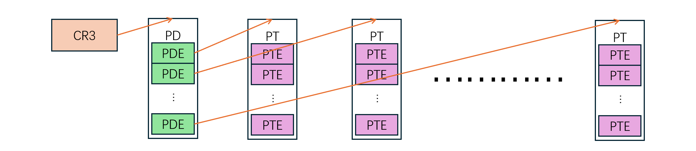
<div align="center">图1 二级页表结构图</div>
二级页表中PDE与PTE均占4字节，每个PD与PT均包含1024项，每个PD与PT均占4096字节，即最小粒度的一页。CR3指向PD，PD中的每个PDE指向PT，PT中的每个PTE指向一个物理页框，一个物理页框的粒度为4k（本系统直接采用4K粒度，当然，还有2M的粒度，但不采用）。这样，依次类推一个CR3的逻辑地址范围为4G。

1. 四级页表PML4项
```c
#pargma pack(push, 1)
typedef union
{
    struct
    {
        UINT64 Present : 1;        // bit 0
        UINT64 ReadWrite : 1;      // bit 1
        UINT64 UserSuper : 1;      // bit 2
        UINT64 WriteThrough : 1;   // bit 3
        UINT64 CacheDisabled : 1;  // bit 4
        UINT64 Accessed : 1;       // bit 5
        UINT64 Ignored1 : 1;       // bit 6
        UINT64 MustBeZero : 1;     // bit 7，必须为 0
        UINT64 Ignored2 : 4;       // bits 8-11
        UINT64 PhysicalAddr : 40;  // bits 12-51，物理地址（右移 12 位）
        UINT64 Ignored3 : 11;      // bits 52-62
        UINT64 ExecuteDisable : 1; // bit 63，NX
    } bits;
    UINT64 raw;
} PML4_ENTRY;
#pargma pack(pop)
```

2. 四级页表PDPT项
```c
#pargma pack(push, 1)
typedef union
{
    struct
    {
        UINT64 Present : 1;
        UINT64 ReadWrite : 1;
        UINT64 UserSuper : 1;
        UINT64 WriteThrough : 1;
        UINT64 CacheDisabled : 1;
        UINT64 Accessed : 1;
        UINT64 Ignored1 : 1;
        UINT64 MustBeZero : 1;    // bit 7，必须为 0
        UINT64 Ignored2 : 4;      // bits 8-11
        UINT64 PhysicalAddr : 40; // bits 12-51
        UINT64 Ignored3 : 11;     // bits 52-62
        UINT64 ExecuteDisable : 1;
    } bits;
    UINT64 raw;
} PDPT_ENTRY;
#pargma pack(pop)
```

3. 四级页表PD项
```c
#pargma pack(push, 1)
typedef union
{
    struct
    {
        UINT64 Present : 1;
        UINT64 ReadWrite : 1;
        UINT64 UserSuper : 1;
        UINT64 WriteThrough : 1;
        UINT64 CacheDisabled : 1;
        UINT64 Accessed : 1;
        UINT64 Ignored1 : 1;
        UINT64 PageSize : 1;      // bit 7，大页标志（2MB）
        UINT64 Ignored2 : 4;      // bits 8-11
        UINT64 PhysicalAddr : 40; // bits 12-51
        UINT64 Ignored3 : 11;     // bits 52-62
        UINT64 ExecuteDisable : 1;
    } bits;
    UINT64 raw;
} PD_ENTRY;
#pargma pack(pop)
```

4. 四级页表PT项
```c
#pargma pack(push, 1)
typedef union
{
    struct
    {
        UINT64 Present : 1;
        UINT64 ReadWrite : 1;
        UINT64 UserSuper : 1;
        UINT64 WriteThrough : 1;
        UINT64 CacheDisabled : 1;
        UINT64 Accessed : 1;
        UINT64 Dirty : 1;         // bit 6，已写入
        UINT64 MustBeZero : 1;    // bit 7，必须为 0
        UINT64 Global : 1;        // bit 8，全局页
        UINT64 Ignored : 3;       // bits 9-11
        UINT64 PhysicalAddr : 40; // bits 12-51，指向 4KB 物理页
        UINT64 Ignored2 : 11;     // bits 52-62
        UINT64 ExecuteDisable : 1;
    } bits;
    UINT64 raw;
} PT_ENTRY;
#pargma pack(pop)
```

对于四级页表，其组织结构如下所示：
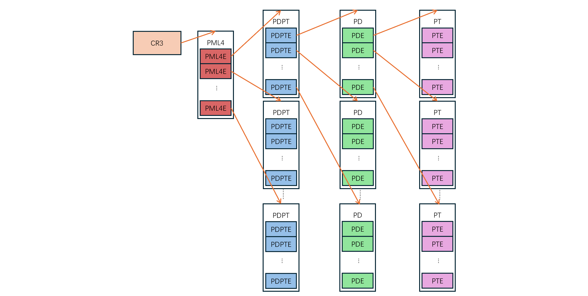
<div align="center">图1 四级页表结构图</div>
四级页表中PML4E、PDPTE、PDE、PTE均占8字节，每个PML、PDPT、PD、PT均包含512项，每个PML、PDPT、PD、PT均占4096字节，即最小粒度的一页。CR3指向PML4，PML4中的每个PML4E指向PDPT，PDPT中的每个PDPTE指向PD，PD中的每个PDE指向PT，PT中的每个PTE指向一个物理页框，一个物理页框的粒度为4k（本系统直接采用4K粒度，当然，还有2M的粒度，但不采用）。这样，以此类推一个CR3的逻辑地址范围为256T。

#### 对于连续分配内存页表的理解
**内核页表直接采用连续内存空间进行存储，不采用离散内存进行映射。这里，仅限讨论内核页表的申请，之后的进程管理再阐述用户页表。**
##### 二级页表
既然采用了最小粒度4K，一个PT可以映射1024个页框，那么，从而得知，一个PT可以映射4M的内存；又因为一个PD可以指向1024个PT，那么，一个CR3，可以指向4G的范围。假设，我的内核页表要恒等映射全部内存地址（内存小于等于4G），我只需要申请一个PD，1024个PT，一共4100KB内存（共1025页），计算公式如下所示：
$$
ALL=(PD+PT)*4K
$$
假设，内存大小只有16M，那么需要一个PD，4个PT，一共20KB内存；内存大小只有15M呢，这种和熟悉的数字明显有不同的大小。我的认为是先将其变为以KB为单位的数，假设后续的算出的总KB为**MEMORY**，单位转换如下所示：
$$
\begin{aligned}
1TB &= 1024GB \\
1GB &= 1024MB \\
1MB &= 1024KB \\
1KB &= 1024B
\end{aligned}
$$
计算公式如下所示：
$$
\begin{aligned}
PTE &= (&MEMORY+4095)&/4096 \\
PDE &= (&PTE+1023)&/1024 \\
\end{aligned}
$$
由于x86最大支持4G的虚拟地址，所以直接默认系统最大只有4G（编译、链接后的）。其实，现代操作系统编译完没多大，一般来说，linux小，Windows大。所以，PD通常为1。

通过上述公式，我们可以得知：PDE即为PT的个数。代入计算**ALL**的公式，即可算出应该为系统页表申请多大的连续空间。

对于二级页表的填充，汇编如下（为什么没有C语言的？因为重构之前就只在BIOS BootLoader中申请系统页表，这里有缺陷，没有形成“函数”，直接硬写，也是当时求知阶段的问题）：

```assembly
register_pde:
    xor eax,eax
    mov byte [ebx],0b0_0_0_0_0_0_1_1
    mov eax,[pt_addr]
    shr eax,8
    and al,0xf0
    mov byte [ebx+1],al
    shr eax,8
    mov byte [ebx+2],al
    shr eax,8
    mov byte [ebx+3],al
    inc esi
    add ebx,4
    mov eax,[pt_addr]
    add eax,4096
    mov [pt_addr],eax
    cmp esi,ecx
    jne register_pde

    shl ecx,12
    mov eax,[pt_addr]
    sub eax,ecx

    mov [pt_addr],eax

    mov ebx,[pt_addr]
    mov ecx,[memory_page]
    xor esi,esi

register_pte:
    xor eax,eax
    mov byte [ebx],0b0_0_0_0_0_0_1_1
    mov eax,esi
    shl eax,12
    shr eax,8
    and al,0xf0
    mov byte [ebx+1],al
    shr eax,8
    mov byte [ebx+2],al
    shr eax,8
    mov byte [ebx+3],al
    add ebx,4
    inc esi
    cmp esi,ecx
    jne register_pte
```

##### 四级页表

既然采用了最小粒度4K，一个PT可以映射512个页框，那么，从而得知，一个PT可以映射2M的内存；又因为一个PD可以指向512个PT，那么，一个PD可以映射1G；又因为一个PDPT可以指向512个PD，那么，一个PDPT可以映射512G；又因为一个PML4可以指向512个PDPT，那么，一个PML4可以映射256T。那么，同理可得，计算公式如下所示：
$$
\begin{aligned}
ALL=(PML4+PDPT+PD+PT)*4K
\end{aligned}
$$
一般来说，对于x64系统页表PML4的个数是1，就拿Linux来说，其给内核的虚拟地址也只有2G，仅仅是比x86的二级分页多1G。

这里的思路与二级页表一致，本系统习惯将最初的单位设置为KB，也假设后续的算出的总KB为**MEMORY**，计算公式如下（有不同，是因为：x86的表项均为4字节，而x64的表项均为8字节）：
$$
\begin{aligned}
PTE &= (&MEMORY+4095)&/4096 \\
PDE &= (&PTE+511)&/512 \\
PDPTE &= (&PDE+511)&/512 \\
PML4E &= (&PDPTE+511)&/512 \\
\end{aligned}
$$
通过上述公式，我们可以得知：PDE即为PT的个数，PDPTE即为PD的个数，PML4E即为PDPT的个数。代入计算**ALL**的公式，即可算出应该为系统页表申请多大的连续空间。

对申请到系统页表区域的划分

对申请到的页表的划分如下所示：
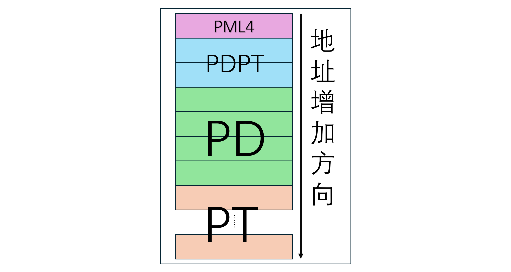
<div align="center">图1 系统页表区域划分</div>
图示为四级页表的区域划分，如果想要二级页表的区域划分，则可以挡住图中的PML4以及PDPT，就可以得到二级页表区域划分。
具体的代码如下所示（可能不规范，请见谅）：

```c
EFI_STATUS MapMemoryRegion(IN EFI_SYSTEM_TABLE *SystemTable,
                           IN OUT BootInfoHead *Info,
                           IN EFI_PHYSICAL_ADDRESS PhysicalStart,
                           IN EFI_PHYSICAL_ADDRESS VirtualStart,
                           IN UINTN Size,
                           IN MemoryType Type)
{
    EFI_STATUS Status;
    UINTN Pages = (Size + 0xfff) >> 12;
    UINTN PTNumber = (Pages + 511) / 512;
    UINTN PDNumber = (PTNumber + 511) / 512;
    UINTN PDPTNumber = (PDNumber + 511) / 512;
    UINTN AllTablePages = PDPTNumber + PDNumber + PTNumber;
    EFI_PHYSICAL_ADDRESS TableBaseAddr = 0;

    Status = SystemTable->BootServices->AllocatePages(AllocateAnyPages,
                                                      EfiRuntimeServicesData,
                                                      AllTablePages,
                                                      &TableBaseAddr);

    if (EFI_ERROR(Status))
    {
        Print(L"Allocate Pages Failed...\r\n");
        return Status;
    }

    SystemTable->BootServices->SetMem((VOID *)TableBaseAddr, AllTablePages * 4096, 0);

    EFI_PHYSICAL_ADDRESS PDPTBaseAddr = TableBaseAddr;
    EFI_PHYSICAL_ADDRESS PDBaseAddr = TableBaseAddr + PDPTNumber * 4096;
    EFI_PHYSICAL_ADDRESS PTBaseAddr = TableBaseAddr + (PDPTNumber + PDNumber) * 4096;

    UINTN PML4Idx = (VirtualStart >> (12 + 9 + 9 + 9)) & 0x1FF;
    UINTN PDPTIdx = (VirtualStart >> (12 + 9 + 9)) & 0x1FF;
    UINTN PDIdx = (VirtualStart >> (12 + 9)) & 0x1FF;
    UINTN PTIdx = (VirtualStart >> 12) & 0x1FF;

    UINT64 Pat = 0;
    if (Type == MemoryType_DirectVGAMemory)
    {
        Pat = 1;
    }

    // 1、先填充PML4
    PML4_ENTRY *PML4BaseEntry = (PML4_ENTRY *)Info->SystemPageTable.PML4PhysicalBaseAddr;
    for (UINTN i = 0; i < PDPTNumber; i++)
    {
        PML4BaseEntry[PML4Idx + i].bits.Present = 1;
        PML4BaseEntry[PML4Idx + i].bits.ReadWrite = 1;
        PML4BaseEntry[PML4Idx + i].bits.PhysicalAddr = (PDPTBaseAddr >> 12) + i;
    }

    // 2、再填充PDPT
    PDPT_ENTRY *PDPTBaseEntry = (PDPT_ENTRY *)PDPTBaseAddr;
    for (UINTN i = 0; i < PDNumber; i++)
    {
        PDPTBaseEntry[PDPTIdx + i].bits.Present = 1;
        PDPTBaseEntry[PDPTIdx + i].bits.ReadWrite = 1;
        PDPTBaseEntry[PDPTIdx + i].bits.PhysicalAddr = (PDBaseAddr >> 12) + i;
    }

    // 3、再填充PD
    PD_ENTRY *PDBaseEntry = (PD_ENTRY *)PDBaseAddr;
    for (UINTN i = 0; i < PTNumber; i++)
    {
        PDBaseEntry[PDIdx + i].bits.Present = 1;
        PDBaseEntry[PDIdx + i].bits.ReadWrite = 1;
        PDBaseEntry[PDIdx + i].bits.PhysicalAddr = (PTBaseAddr >> 12) + i;
    }

    // 4、最后填充PT
    PT_ENTRY *PTBaseEntry = (PT_ENTRY *)PTBaseAddr;
    for (UINTN i = 0; i < Pages; i++)
    {
        PTBaseEntry[PTIdx + i].bits.Present = 1;
        PTBaseEntry[PTIdx + i].bits.ReadWrite = 1;
        PTBaseEntry[PTIdx + i].bits.MustBeZero = Pat;
        PTBaseEntry[PTIdx + i].bits.PhysicalAddr = (PhysicalStart >> 12) + i;
    }

    return Status;
}
```

这样就完成了系统页表的申请和填充，再通过重载CR3，就可以实现虚拟地址空间的切换。但这就结束了吗？绝不是的，有一个问题，以后，同样会出现在系统调用的实现中（用户态和内核态切换时，PC指向一个虚拟地址，但可能物理地址是完全不一样的，这样就会导致肯可能的错误）。为了解决这个问题，本系统决定，将该页、前一页、后一页全部进行恒等映射，这样就可以处理这个问题。

#### 对于分散分配内存页表的理解

这部分就是常用的页表映射的方式，因为在操作系统实际运行时，伙伴系统分配内存大概率不连续，所以，只能用虚拟的方式，使得不连续的物理内存在逻辑上连续。站在页表本身的实际位置角度去说，这是无所谓的，只要记住页表本身即可，这样才能避免系统本身造成的内存泄露；站在进程申请内存的角度，在本系统中，则必须遵循“谁申请谁释放”的原则（不过，本系统会逐步考虑由系统检测并释放一些内存的思路）。

### 进入内核

内核完全采用裸二进制的方式进行组织，不借助现有的任何链接文件格式。以这种方式进行开发，更加方便理解计算机是如何取指、执行。如果用现有链接格式，在理解上，就会多加一层，不是那么的直观。

#### 内核入口
在内核入口 start.asm 文件中，对于 BIOS BootLoader 来说，它与内核约定了传值的 内存位置，在内核初始化阶段，内核可以直接到对应位置取 BootInfo；对于 UEFI BootLoader 来说，系统将 rbx 的值写入了 rdi（遵循 System V AMD64 调用约定规定）， 这样就可以保证使用编译链接后的内核可以直接通过指针访问到 BootInfo；此外，系统 还重新加载了系统的临时栈（这个栈是被声明为.stack 意味着这个栈可以根据需求，可 做为永久的和临时的栈）

UEFI 具体将 BootInfo 首地址送入 rbx 以及动态绑定跳转位置的 C 语言代码如下：

```c
asm volatile("mov %0, %%rbx\n\t"
				:
				: "r"(KeepPointerBootInfo)
				: "rbx", "memory");
typedef void (*KernelEntry)();
KernelEntry entry = (KernelEntry)KernelVirtualBaseAddressX64;
entry();
```
这部分最主要的就是实现BootInfo的正确传递。

BIOS方式下对应的start.asm如下所示：

```assembly
[bits 32]

section .text._start
extern kernel_init

global _start

_start:
    cli
    call kernel_init
    jmp $
```

BIOS下，本系统直接规定了传值的位置，直接到指定物理地址取值即可。

UEFI方式下对应的start.asm如下所示：

```assembly
[bits 64]

section .text._start
extern kernel_init

global _start

_start:
    cli
    lea rsp, [kernel_stack_top]
    mov rdi, rbx
    call kernel_init
    jmp $

; 系统临时栈
section .stack
align 4096
kernel_stack:
    resb 4096
kernel_stack_top:

section .note.GNU-stack noalloc noexec nowrite progbits
```

UEFI下，与start.asm对应的main.c如下所示（不完整）：

```c
#include <gmos.h>

char *string = "Hello World...\n";

// 只有这一个静态全局瞬时RSDP 这也是热插拔的入口
RSDPDescriptor_t *g_rdsp;
mmnode_t *g_first_node;

// 早期内存分配器信息 用物理内存
memblock_head_t *memory_new_use_memblock;

// BSP IDT指针
void *g_idt_ptr;

per_cpu_t cpu;

void kernel_init(BootInfoHead *Info)
{
    asm volatile("sti");
    while (TRUE)
    {
        DEBUG;
    }
}
```

UEFI下，本系统将BootInfo的地址传递给rbx，然后根据GCC的**System V AMD64 ABI**传值约定，将ebx中的内容交给rdi，这样便可以进入main.c时，kernel_init(BootInfoHead *Info)中可以直接引用。为什么先要用rbx？这是因为本系统怕被无故占用，所以多了一步。

#### 系统页表逻辑地址分配

这个部分要分为两个来说，分别为x86二级分页以及x64四级分页。

##### x86二级分页

由于前面解释过为什么x86二级分页虚拟地址只有4G，所以，这里不做任何解释，直接说设计，x86二级系统页表的划分如下所示：


<div align="center">图1 x86系统页表虚拟地址划分</div>

系统页表中高1G作为内核的代码区。低3G则要看情况：如果物理内存≤3G，则直接全部恒等映射；如果物理内存>3G，则采用按需分配。

##### x64四级分页


<div align="center">图1 x64系统页表虚拟地址划分</div>

由于前面解释过为什么x64四级分页虚拟地址有256T，所以，这里不做任何解释。因为虚拟地址已经足够大，甚至在某种程度上，不需要文件系统的存在（这是大黑书中提出的一个观点），这里就直接物理内存全部恒等映射（本系统认为物理内存不可能超过128T），高128T的前128T-2G用来映射显存、MMIO等硬件预留，最后的2G用来映射内核。

##### 系统页表的取舍

曾经，有个天真的想法：认为系统页表在逻辑上多映射一次，将不连续的可用物理内存在逻辑上连续，可以避免很多问题，但最终证明大道至简，不如恒等映射（在Linux中则是直接映射）。

#### 简单设备管理

##### ARDS及EFI_MEMORY_DESCRIPTOR

```c
typedef struct ards
{
    uint64_t base;
    uint64_t limit;
    uint32_t type;
} ards_t;
```

ARDS是针对BIOS的，具体的Type如下所示：

|        类型值         |               名称               |         含义         |
| :-------------------: | :------------------------------: | :------------------: |
|           1           |      **AddressRangeMemory**      | **操作系统可用内存** |
|           2           |     **AddressRangeReserved**     |   **系统保留内存**   |
|           3           |       **AddressRangeACPI**       |   **ACPI回收内存**   |
|           4           |       **AddressRangeNVS**        |   **ACPI NVS内存**   |
|           5           |     **AddressRangeUnusable**     |    **不可用内存**    |
|           6           |     **AddressRangeDisabled**     |    **已禁用内存**    |
|           7           | **AddressRangePersistentMemory** |    **持久化内存**    |
|           8           |    **AddressRangeUnaccepted**    |    **未接受内存**    |
|         9~11          |          **Undefined**           |      **未定义**      |
|          12           |         **OEM Defined**          |     **OEM定义**      |
|     13~0xefffffff     |          **Undefined**           |      **未定义**      |
| 0xf0000000~0xffffffff |         **OEM Defined**          |     **OEM定义**      |

同理，EFI_MEMORY_DESCRIPTOR在作用上等价古早BIOS的ARDS，描述符具体的Type如下所示：

| 类型值 |              名称              |                             含义                             |
| :----: | :----------------------------: | :----------------------------------------------------------: |
|   0    |   **EfiReservedMemoryType**    |                  保留内存类型，**不可使用**                  |
|   1    |       **EfiLoaderCode**        |                 加载的UEFI应用程序的代码部分                 |
|   2    |       **EfiLoaderData**        |                 加载的UEFI应用程序的数据部分                 |
|   3    |    **EfiBootServicesCode**     |             加载的UEFI启动服务驱动程序的代码部分             |
|   4    |    **EfiBootServicesData**     |             加载的UEFI启动服务驱动程序的数据部分             |
|   5    |   **EfiRuntimeServicesCode**   |            加载的UEFI运行时服务驱动程序的代码部分            |
|   6    |   **EfiRuntimeServicesData**   |            加载的UEFI运行时服务驱动程序的数据部分            |
|   7    |   **EfiConventionalMemory**    |        **空闲（未分配）内存**，操作系统可用于一般用途        |
|   8    |     **EfiUnusableMemory**      |                检测到错误的内存，**不可使用**                |
|   9    |    **EfiACPIReclaimMemory**    |         存放ACPI表的内存，操作系统在读取后可回收利用         |
|   10   |      **EfiACPIMemoryNVS**      | ACPI非易失性存储内存，由固件使用，操作系统**必须保留**其内容 |
|   11   |     **EfiMemoryMappedIO**      |               内存映射IO区域，供运行时服务访问               |
|   12   | **EfiMemoryMappedIOPortSpace** |            内存映射IO端口空间（主要用于安腾架构）            |
|   13   |         **EfiPalCode**         |              处理器抽象层（PAL）代码保留的内存               |
|   14   |    **EfiPersistentMemory**     | 支持字节寻址非易失性的内存（如NVDIMM），通常可视为常规内存使用 |
|   15   |  **EfiUnacceptedMemoryType**   | 尚未被固件接受的内存（多见于支持TDX等技术的平台），在使用前必须由引导目标先“接受” |
|   16   |      **EfiMaxMemoryType**      |               枚举值上限标记，并非实际内存类型               |

拥有基础数据后，内核的基石（内存管理子系统）就有了着落。

##### ACPI
在BIOS和UEFI两种方式下，寻找ACPI的入口是相当不同的：BIOS下，需要全部扫描；UEFI下，直接根据协议获取。ACPI的根签名"RSD PTR "，在BIOS方式下，本系统采用KMP算法对规定的0xe0000~0xfffff区域进行扫描，完成对ACPI根的定位；在UEFI方式下，采用寻找**EFI_GUID acpi_1_0_guid**或**EFI_GUID acpi_2_0_guid**协议的方式定位ACPI根。

BIOS下全流程的代码如下：

```c
void build_kmp_table_static(const char *pattern, size_t pattern_len, size_t next[])
{
    next[0] = 0;
    size_t j = 0;
    for (size_t i = 1; i < pattern_len; i++)
    {
        while (j > 0 && pattern[i] != pattern[j])
            j = next[j - 1];
        if (pattern[i] == pattern[j])
            j++;
        next[i] = j;
    }
}
```

```c
RSDPDescriptor_t *seek_rsdp_addr(addr_t start_addr)
{
    char *keep = (char *)start_addr;
    char *end = (char *)(ACPI_START_ADDR + ACPI_SIZE);
    char rsdp_signature[8] = "RSD PTR ";
    size_t next[8] = {0};
    build_kmp_table_static(rsdp_signature, sizeof(rsdp_signature), next);
    size_t j = 0;
    while (keep != end)
    {
        while (*keep != rsdp_signature[j] && j > 0)
            j = next[j - 1];
        if (*keep == rsdp_signature[j])
        {
            keep++;
            j++;
        }
        else
        {
            keep++;
        }
        if (j == sizeof(rsdp_signature))
        {
            return (RSDPDescriptor_t *)(keep - j);
        }
    }
    return (RSDPDescriptor_t *)nullptr;
}
```

```c
void rsdp_init()
{
    rdsp = seek_rsdp_addr((addr_t)ACPI_START_ADDR);
}
```

这里的next数组“申请”在栈中，这个阶段有没有内存管理都无所谓，最重要的是系统总体中包含的rsdp全局变量必须得到初始化，否则，内核将永远无法得知外壳下的主板到底有什么外设。

UEFI下全流程代码：

```c
EFI_STATUS GetRSDPTR(IN EFI_SYSTEM_TABLE *SystemTable,
                     OUT BootInfoHead *Info)
{
    // 从 UEFI 系统表里找到 RSDP
    for (UINTN i = 0; i < SystemTable->NumberOfTableEntries; i++)
    {
        EFI_GUID acpi_2_0_guid = {0x8868e871, 0xe4f1, 0x11d3, {0xbc, 0x22, 0x00, 0x80, 0xc7, 0x3c, 0x88, 0x81}};
        // EFI_GUID acpi_1_0_guid = {0xeb9d2d30, 0x2d88, 0x11d3, {0x9a, 0x16, 0x00, 0x90, 0x27, 0x3f, 0xc1, 0x4d}};
        if (CompareGuid(&SystemTable->ConfigurationTable[i].VendorGuid, &acpi_2_0_guid))
        {
            Info->BootAcpiPhysicalAddress =
                (EFI_PHYSICAL_ADDRESS)SystemTable->ConfigurationTable[i].VendorTable;
            return EFI_SUCCESS;
        }
    }
    return EFI_NOT_FOUND;
}
```
UEFI的相对来说简单，这是UEFI规范和实现其工程师的功劳。

##### PCI/PCIe

#### 内存管理

在讲述内存管理之前，先展示本系统内存管理的头文件依赖，如下所示：

<div align="center">图1 头文件引用</div>
本系统内存管理子模块会老老实实沿着头文件的传递进行讲述。可能存在问题，请见谅。

根据如上头文件依赖图，有

##### 早期内存分配器
早期内存分配器的目的是避免内存管理子系统的循环自举。本系统固定给早期内存分配器线性分配四页，但用宏定义解决的，可以在日后的开发中随时修改。（只要不太离谱的数就行）
具体的实现思路是以下几点：

1. 根据ARDS或EFI_MEMORY_DESCRIPTOR线性分配4k内存，这块内存用于存放进入内核后还未建立起内存管理时的申请内存信息。
2. 将上述分配的内存块的信息写入申请到的内存中，并将用于存放数据的块标记为可回收。
3. 计算**struct page**所占内存，申请**struct page**所需要的内存
4. 先根据ARDS或EFI_MEMORY_DESCRIPTOR填充**struct page**，再根据第一步申请到的内存中的信息进而再次初始化**struct page**

总结来说，就是：先根据ARDS或EFI_MEMORY_DESCRIPTOR标记一次**struct page**，然后，再根据早期内存分配器标记一次**struct page**。

其中有一点需要被说明，这里的线性分配不是智能的：每当需要申请内存，都要先访问第一步申请到的内存，查看是否存在还未用完的早期内存分配器描述符，如果没用完且符合申请要求，则在该描述符继续申请；如果没有用完且不符合申请要求，则录入“新”的描述符。

这里对早期内存分配器描述符的管理采用在第一步申请到的内存中构建递增栈的方式就行管理。每当压入“新”的早期内存分配器描述符时，都要用“旧”的早期内存分配器描述符的起始地址对比“新”的早期内存分配器描述符的起始地址，以免再同一块区域进行读写，破坏元数据，造成内存管理子系统的自举失败。本系统定义的早期内存分配器描述符如下所示：

```c
typedef struct memblock_entry
{
    uint64_t PhysicalStart;
    uint64_t NumberOfPages;
    uint64_t used_pages;
} memblock_entry_t;
```

本系统早期内存分配器描述符管理结构如下：
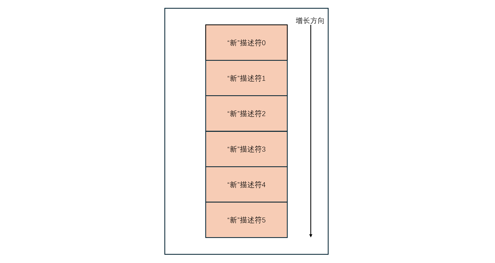

<div align="center">图3 描述符排布图</div>

还有一个设计，作者也忘了，改代码的时候读了一遍，发现是早期内存分配器的头独占一页。

整个早期内存分配器的流程如下所示：
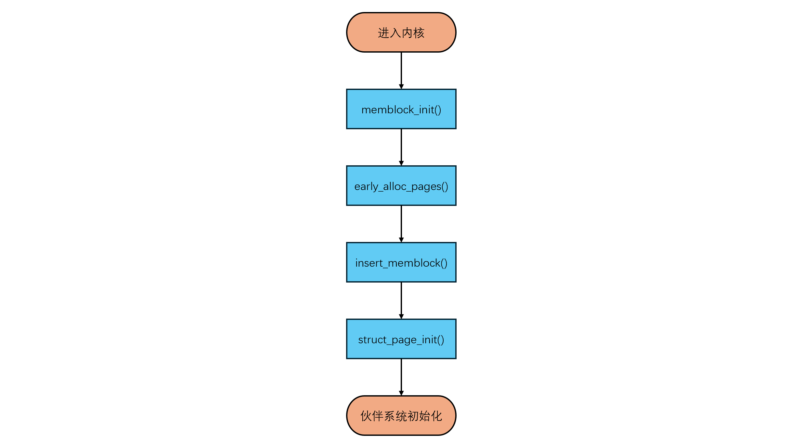

<div align="center">图4 早期内存分配器流程图</div>

这个过程是线性的，并不代表这块所需的内存是不被回收的，这块所代表的“新”内存描述符本身就是可回收的，在初始化伙伴系统时，会在**struct page**中进行标记，然后便可以“舍弃”这部分，这样就回收了这块内存。如果不理解的话，可以参考RUST所有权的思路。

这里记录一下，在写FAT32文件系统时，分配了FAT的内存，直接把`struct page`区直接覆盖了，最后，用了一上午，发现问题是：

```c
    /*
     * 第二次填充（根据Mem_Block）
     */
    for (size_t i = 0; i < memory_new_use_memblock->desc_count; i++)
    {
        memblock_entry_t *entry = (memblock_entry_t *)((uint8_t *)memory_new_use_memblock->stack_end + i * sizeof(memblock_entry_t));
        page_t *page = (page_t *)phys2page(g_first_node, entry->PhysicalStart);
        for (size_t j = 0; j < entry->used_pages; j++)
        {
            page->flags = FLAGS_RESERVED;
        }
    }
```

上面的代码中`for (size_t j = 0; j < entry->used_pages; j++)`忘加`page++`了。修改完，如下所示：

```c
    /*
     * 第二次填充（根据Mem_Block）
     */
    for (size_t i = 0; i < memory_new_use_memblock->desc_count; i++)
    {
        memblock_entry_t *entry = (memblock_entry_t *)((uint8_t *)memory_new_use_memblock->stack_end + i * sizeof(memblock_entry_t));
        page_t *page = (page_t *)phys2page(g_first_node, entry->PhysicalStart);
        for (size_t j = 0; j < entry->used_pages; j++, page++)
        {
            page->flags = FLAGS_RESERVED;
        }
    }
```

##### NUMA

这里的NUMA仅仅是一个雏形，还没有完整，作者为了内容的完整以及后续的可扩展性，先预留了这么一层。node结构体如下所示：

```c
typedef struct mmnode
{
    size_t mmnode_id;
    phys_addr mmzone[ZONE_PRE_NODE];
    phys_addr pf_base_addr;
    size_t pf_number;
    struct mmnode *prev;
    struct mmnode *next;
    phys_addr mem_map;
} mmnode_t;
```

这里，先阐述只有一个节点的分配情况，本系统是将node与zone的结构紧凑放在一起，具体情况如下所示：
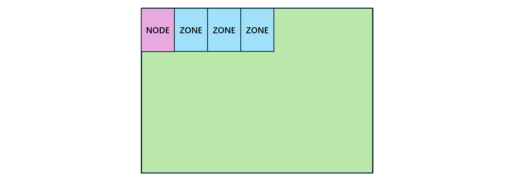
<div align="center">图1 内存管理根结构</div>

从以上的结构体，可以看出node的组织是通过双向链表进行的组织的，但作者认为：需要有一个根本的入口去寻找所有的内存管理子系统的结构，所以设置了一个系统的全局变量，如下所示：

```c
mmnode_t *g_first_node;
```

node双链表的结构如下所示：
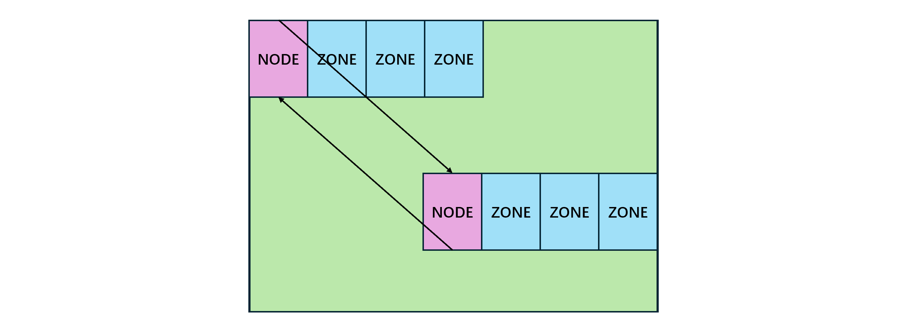

<div align="center">图1 node双链表</div>

这个变量在编译链接后的二进制文件中恒为零，这样就可以保证每次将内核加载进内存都是“干净”的，这里，目前的.map文件的地址如下所示（这里的值每个人都可能不一样，因为对于开发操作系统的人来说，如果不写链接脚本指定一些地址，那么，在开发者看来，编译器就是黑盒。小声：他妈的，怎么又是黑盒）：
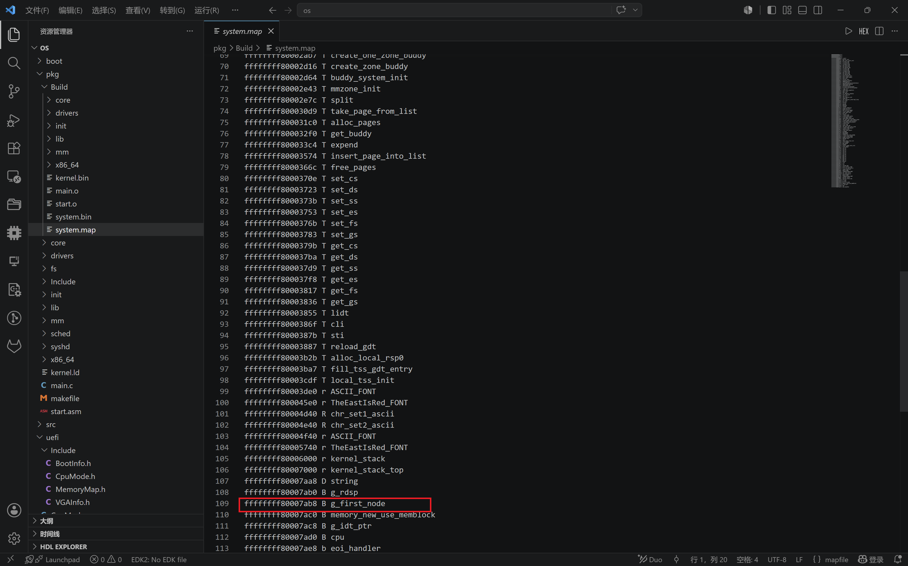

<div align="center">图1 链接地址</div>

虽然，根据node首地址，可以直接推出zone指针地址。但本系统还是采用数组的形式，将地址再存一次。这部分就是这样了，只恨财力与精力都不足。

##### Buddy System

###### 基础知识

这里先说伙伴系统的理论：伙伴系统本质上就是一个分块的路逻辑，它将整个内存空间划分成不同的块（块的大小从一页到几页不等）。在系统层面，用这样的方式，便可以做到逻辑上的去除外部碎片。但真的是效率达到最大了吗？这显然是有问题的，但系统不管，它将内存利用率交给了申请者去管理，统统转化为了内部碎片利用率的问题。但问题始终没有被解决……这就需要之后的slab机制了。
上面是总结性的话，接下来，逻辑性的表达如下所示：


<div align="center">图5 伙伴系统示意</div>
从上面的图，我们不难看出：基本上所有的理论性的知识好像都是这么讲的，好像就是它们把所有物理内存当作一整块处理，但实际上不是这样。

###### 设计

首先，先要讲清楚实现的原则：

1. 永远先从最大块开始划分
2. 当前连续块不够目前的ORDER，才可以ORDER--
3. 真实的物理内存一定是离散可用的（这就证明了基础知识中那种整体划分的讲述是存在大问题的）

对于本系统伙伴系统，目前的实现所依赖的结构体如下所示：

```c
typedef struct page
{
    bool head;
    PAGE_FLAGS flags;
    size_t order;
    size_t ref_count;
    size_t mmap_count;

    union
    {
        struct page *prev;
        struct kmem_cache_head *kmem_cache_head; // 分配给 slab 后指向所属 kmem_cache_head
        struct slab_head *slab_head;
    };

    // 这个指针可以复用为非连续页指针 也就是连续分配
    struct page *next;
} page_t;

typedef struct page_free_list
{
    size_t free_number;
    page_t *next;
} page_free_list_t;

typedef struct mmzone
{
    // 这个lock先预留出来 之后改为LOCK
    bool lock;
    size_t start_pf_number;
    size_t pf_number;
    phys_addr mmnode_addr;
    page_free_list_t free_list[MAX_ORDER];
} mmzone_t;
```

这设计肯定是不完美的，所以请见谅，后续一定会更新迭代的。

本系统在初始化伙伴系统时，采取了分区初始化的策略，具体步骤如下：

1. 先根据实际内存大小建立**struct page**区域
2. 根据ADRS或EFI_MEMORY_DESCRIPTOR先填充一次**struct page**
3. 根据早期内存分配器再填充一次**struct page**
4. 结合各分区的宏扫描全部的**struct page**用以统计当前可用页和不可用页
5. 在**4**的过程中，对可用页根据实现的原则进行可用页（块）的挂载，操作的对象是**struct page**，将其按尾插法挂在各阶的free_list后。

在根据EFI_MEMORY_DESCRIPTOR填充**struct page**时，这里只将**EfiConventionalMemory**类型内存标记为可用，剩下的均标记为不可用。

为什么要用尾插法？因为这样可以保障最初的几次内存分配page_t的值不会“太吓人”，也可以说测试的时候，一眼丁真，更好地观察十六进制数。

伙伴系统的实现还需实现**struct page**到绝对物理地址的转换，具体要实现的函数如下所示（这里仅仅放函数声明）：

```c
phys_addr pf2page(mmzone_t *zone, size_t number);

phys_addr phys2page(mmnode_t *node, phys_addr addr);

phys_addr page2phys(mmzone_t *zone, page_t *page);
```

这样，对于内核程序，就可以完全操作内存了，如果没有这个转换函数，就只能拿到**page_t**，相当于什么也没申请到。

这里，本系统认为转换时，必须带上node或zone，这样能判断申请到底需要的是哪一异构内存的资源。初始化时的函数调用如下所示：


<div align="center">图1 初始化顺序</div>

所有的代码都在github上，如有需要，可以对照文档和代码共同查看。

###### 申请内存

对外暴露的API只有一个，如下所示：

```c
page_t *alloc_pages(mmzone_t *zone, size_t order);
```

它的实现紧紧依赖如下所示的函数：

```c
void split(mmzone_t *zone, size_t order);
```

具体的逻辑如下所示：

当申请的阶数不满足需要时，向更高的阶数进行寻找，找到第一个比申请阶数大的即可，然后将第一个阶数大的一直拆分，拆到申请阶数时即可，这里要注意：不是整个高阶都拆，而是只是二分式的拆一个即可，不要用递归，原因在讲完释放内存的逻辑一起说明。

###### 释放内存

对外暴露的API只有一个，如下所示：

```c
bool free_pages(mmzone_t *zone, page_t *blk);
```

它的实现紧紧依赖如下所示的函数：

```c
page_t *expend(mmzone_t *zone, page_t *blk1, page_t *blk2, bool flags);

page_t *get_buddy(mmzone_t *zone, page_t *blk);
```

具体的逻辑如下所示：

先判断当前阶数是否有兄弟，如果没有，直接使用头插法，插入对应ORDER的free_list双链表即可；如果有，则先合并，然后再去到合并后的阶数再一次判断是否有兄弟，如果有继续重复操作，不要用递归。

###### 不用递归的原因

首先，要明确一点，系统栈不够了怎么办？在手搓系统时，IDT全部都是空的，不可能说有“人”给你兜底，当缺页时，会主动向系统申请内存。所以，必须在有限的循环中，解决这一问题，作者的想法是以内存为中心，不仅仅是对于各个AP的，更是对于系统基础的，其它的一切结构都必须依赖初始化好的内存管理子系统，例如：IDT、设备表、slab缓存块等。

##### Slab

###### 前提

请大伙先想一个问题：面向对象中的对象实例化，是不是需要几个字节的内存就是分配几个字节？答案是肯定的，就是需要多少分配多少。那回到目前只有伙伴系统的操作系统中，每次申请内存都是直接给页（块），不可能需要多少字节给多少字节。那这就必须引入新的机制，其实，说好听点叫机制，说不好听就是添加必要的“冗余”信息。（这就是高情商和低情商doge）

###### 设计

1. 同一类的结构体需要有一个统一的 kmem_cache 入口，对于特定的模块，就是特 定的结构体；但对于共用的部分来说，其实这个统一的 kmem_cache 入口，就是同一大 小的结构体的入口；kmem_cache 的入口是一个头，如同 acpi 的头一样，通过对齐页， 通过 phys_addr phys2page(mmnode_t *node, phys_addr addr)函数，可以直接定位到 struct 大连交通大学本科毕业设计 19 page 的位置，去查看，该块的情况，例如：该块的阶数。如果，该块不是头块，那么就 会复用 prev 指针指向头页的物理地址，由于 kmem_cache object 的大小是固定的，所以 不需要过于“复杂”的嵌入式指针管理空闲对象。对于 kmem_cache object 的初始化，采 用延迟初始化
2. 创建 kmem_cache object 只是一个开始，该 object 中，还有 slabs_full、slabs_partial、 slabs_full 三个链表连接的都是 slab object 块。slab head object 的组织方式同 kmem_cache object 的组织方式相同，但 slab head 中有指向 kmem_cache object 的指针，这样为释放 提供了便利
3. 创建 slab object，这部分完全采用嵌入式指针，指针的位置完全根据 stride 和 align 去判断。因为对于不同大小的结构体，空闲链表的指针所处相对位置是完全不一样的， 如果采用同一个偏移的话，一定会造成数据的破坏。所以必须通过计算去动态确定指针 的位置
4. 创建 slab object 时，要先判断是不是 kmem_cache object 中是否存在 slabs_partial 或 slabs_free，优先使用 slabs_partial。如果存在 slabs_partial，从该 slab 块中取对象后， 要判断是否 free_list 为 NULL，如果为 NULL，则要再判断是否全部初始化，如果初始 化了，则要将该 slab 块用头插法挂载在 slabs_full 上。如果被取的是 slabs_free，则需要 将该块挂到 slabs_partial 上，并对相应的字段进行修改
5. 释放 slab object 时，要找到该 slab object 所属的 slab 块的头，这个就要通过嵌入 式指针，通过特定位置的指针，找到对应的 struct page，如果不是头块，就根据复用指 针，找到头块，然后再根据 struct page 去找到 slab_head，这样就可以将被释放的 slab object 挂载到 free_list 上，从而实现释放的逻辑。如果头中的 inuse 量从 all_objects 变为 all_objects-1，则要将该 slab 块从 slabs_full 挂载到 slabs_partial；如果头中的 inuse 量变 为 0，则要将该 slab 块从 slabs_ partial 挂载到 slabs_free
6. 延迟初始化，为了尽可能地保证 slab object 的快速申请，系统先初始化特定数量 的空间（也就是初始化嵌入式指针和将 slab object 空间置 0），这样便可以不用，全部初 始化，尽可能避免了不必要的开销，加快了申请的速度，未初始化的起始地址在头中用 通用指针标记位置，一块 slab 区域在逻辑上被分成了初始化区和未初始化区
7. 释放 kmem_cache 时，系统会根据 inuse 字段是否为 0，再去调用伙伴系统的 free_pages()
8. 必须设置对齐，这样可以满足一些硬件的需求

slab机制的总体图如下所示：
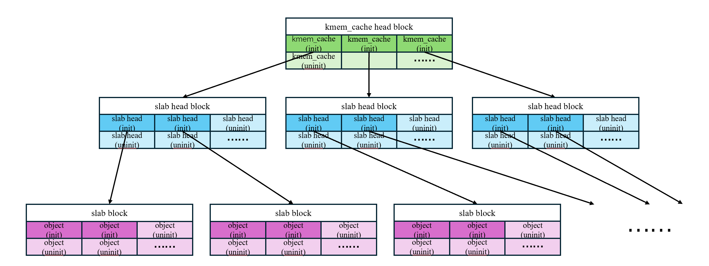
<div align="center">图1 slab机制</div>

slab机制所依赖的结构体如下所示：

```c
typedef struct kmem_cache_head
{
    bool head;
    size_t pages; // 一共有多少页
    size_t all_objects;
    size_t uninit_objects;
    size_t init_per_objects; // 这个值是可变的 为的是负载均衡
    size_t stride;           // 这个字段是有用的 给下一层的初始化用
    size_t slab_obj_size;    // 规定全局
    size_t slab_obj_align;   // 规定全局
    size_t inuse;
    void *free_list;
    void *uninit_ptr;
    struct kmem_cache_head *next; // 用于扩展 一般用不上
    mmnode_t *node;
    mmzone_t *zone;
} kmem_cache_head_t;

/*
 * 被分配到的slab块要懒初始化 得不够了且slab块中还有未初始化页才可以进行懒初始化（延迟初始化）
 * 每个被分配到的页都要有slab_head 这样可以保证只要对齐就能找到对应object->slab 为释放提供便利
 *
 */
typedef struct slab_head
{
    bool head;    // slab_head本身的地址就是首页基地址
    size_t pages; // 用来记录这个slab块被分配了多少个页
    size_t all_objects;
    size_t uninit_objects;
    size_t init_per_objects;
    size_t size;
    size_t stride;
    size_t inuse;

    // 这两个指针是给slabs_full slabs_partial slabs_free用的
    struct slab_head *prev;
    struct slab_head *next;

    // 这两个都存虚拟地址 因为malloc()最后会给进程一个映射后的地址 直接加free_list - slab_base就行
    void *free_list;
    void *uninit_ptr;
    mmnode_t *node;
    mmzone_t *zone;
    void *kmem_cache;
} slab_head_t;

// 这个就是kmem_cache块中的object
typedef struct kmem_cache
{
    size_t size;   // 每个slab object的大小
    size_t align;  // 对齐要求
    size_t stride; // 对齐后的步长
    slab_head_t *slabs_full;
    slab_head_t *slabs_partial;
    slab_head_t *slabs_free;
    mmnode_t *node;
    mmzone_t *zone;
} kmem_cache_t;

typedef struct free_object
{
    kmem_cache_t header;
    struct free_object *prev;
    struct free_object *next;
} free_object_t;
```

它所依赖的对齐宏如下所示：

```c
#define ALIGN_UP(size, align) (((size) + (align) - 1) & ~((align) - 1))
```

这个对齐宏其实一直在使用，例如：之前的页表空间的申请。这个本质就是向上对齐。

对于每个对象来说，其实都有四个嵌入式指针，分别是prev、next、node、zone。至于指针的大小，一直忘了说，直接借用了预编译时的两个编译器宏，如下所示：

```c
// 默认数据类型
#if defined(__i386__)
typedef uint32_t size_t;
#elif defined(__x86_64__)
typedef uint64_t size_t;
#endif

// 地址类型地址
typedef size_t addr_t;
typedef addr_t phys_addr;
typedef addr_t virt_addr;
```

这样，编译器就可以根据-m选项确定生成的每个指针占多少字节，例如：-m 32指针为4字节，-m 64指针为8字节。

###### 申请对象

申请对象时，必须有kmem_cache以及slab head block作为支撑，如果没有，先申请kmem_cache，通过如下函数，便可以完成对象的申请：

```c
void *create_slab_object(kmem_cache_t *kmem_cache_head);
```

###### 释放对象

释放对象采用以下的函数：

```c
bool free_slab_object(void *obj, size_t size);
```

主要是将对象使用头插法挂在空闲链表。

###### 本系统slab机制提供函数

所有的函数如下所示：

```c
kmem_cache_head_t *create_kmem_cache(mmnode_t *node, size_t slab_obj_size, size_t slab_obj_align);

bool free_kmem_cache(kmem_cache_head_t *kmem_cache);

void set_objs_per_init_kmem_cache(kmem_cache_head_t *kmem_cache_blk, size_t val);

kmem_cache_t *create_kmem_cache_object(kmem_cache_head_t *kmem_cache);

bool free_kmem_cache_object(kmem_cache_head_t *kmem_cache_blk, kmem_cache_t *kmem_cache_obj);

slab_head_t *create_slab(kmem_cache_t *kmem_cache_obj);

bool free_slab(slab_head_t *slab);

void set_objs_per_init_slab(slab_head_t *slab, size_t val);

void *create_slab_object(kmem_cache_t *kmem_cache_head);

bool free_slab_object(void *obj, size_t size);
```

这里的总思路是同伙伴系统一致的：谁申请谁管理，如果忘记了，便会造成内存泄漏。至于像GC一样的机制，系统会在后续的更新中尽量留出GC所依赖的基础功能，为系统的扩展尽量留出空间。

###### 与Linux不同点

这里的不同点是：本系统对空闲对象的管理使用了双嵌入式链表，而Linux采用的是单链表。作者目前不知道怎样测试系统的极限，所以真的不清楚哪种更好，请见谅。

#### 进程管理

作者认为：基础知识就不需要讲了吧，如果没有了解过，请先阅读经典大黑书。接下来，进入正题。

首先，PCB（TCB）的结构体如下所示：

```c
typedef enum
{
    TASK_STATUS_RUNNING = 0,
    TASK_STATUS_READY,
    TASK_STATUS_SUSPEND,
    TASK_STATUS_BLOCK,
    TASK_STATUS_DEAD
} TASK_STAUS;

#pragma pack(push, 1)
typedef struct gr_x86
{
    uint32_t eax;
    uint32_t ebx;
    uint32_t ecx;
    uint32_t edx;
    uint32_t esi;
    uint32_t edi;
    uint32_t ebp;
    uint32_t esp;
} gr_x86_t;
#pragma pack(pop)

#pragma pack(push, 1)
typedef struct sr_x86_64
{
    uint16_t cs;
    uint16_t ds;
    uint16_t ss;
    uint16_t es;
    uint16_t fs;
    uint16_t gs;
} sr_x86_64_t;
#pragma pack(pop)

#pragma pack(push, 1)
typedef struct gr_x64
{
    uint64_t rax;
    uint64_t rbx;
    uint64_t rcx;
    uint64_t rdx;
    uint64_t rsi;
    uint64_t rdi;
    uint64_t rbp;
    uint64_t rsp;
    uint64_t reg8;
    uint64_t reg9;
    uint64_t reg10;
    uint64_t reg11;
    uint64_t reg12;
    uint64_t reg13;
    uint64_t reg14;
    uint64_t reg15;
} gr_x64_t;
#pragma pack(pop)

typedef struct mm
{

} mm_t;

typedef struct task
{
    size_t pid;
    size_t prio;
    TASK_STAUS status;

    /*
     * 当使用 -m32 时，GCC 会自动定义 __i386__（x86-32）
     * 当使用 -m64 时，GCC 会自动定义 __x86_64__（x86-64）
     */

#if defined(__i386__)
    gr_x86_t gr;
#elif defined(__x86_64__)
    gr_x64_t gr;
#endif

    sr_x86_64_t sr;

    fpu_x87_t fpu_x87;

} task_t;
```

到了这里，大伙们就会发现slab机制的必要性，假如task_t的规模很大，那完完全全可以直接分配一页；如果一页可以放下多个PCB（TCB），那是不是有点太浪费内存了，这时候，slab机制就是必要的。

##### 经典实现

###### 先到先服务

##### 完全公平调度

###### 前置知识

红黑树是必要的，本系统红黑树的实现借助四阶B树理解，等价的四阶B树节点如下所示：


<div align="center">图1 rbnode</div>

借助考研的只是总结下来，红黑树有四条规律：

1. 不红红
2. 根叶黑
3. 黑路同
4. 左根右（这里表明红黑树还是一棵二叉排序树）

接下来，先说红黑树插入的实现，具体骨架如下（这里直接过度到违反不红红的情况，不红红的情况已经说明父节点是红的）：

```c
void insert_rbtree_fixup(rbtree_node_t *node)
{
    if (node == NULL || node->parent == NULL)
        return;

    rbtree_node_t *parent = node->parent;
    rbtree_node_t *gparent = node->parent->parent;

    // 判断四种情况
    if (gparent->l_child == parent)
    {
        rbtree_node_t *uncle = gparent->r_child;

        if (parent->l_child == node)
        {
            ...
        }
        else
        {
            ...
        }
    }
    else
    {
        rbtree_node_t *uncle = gparent->l_child;

        if (parent->l_child == node)
        {
            ...
        }
        else
        {
            ...
        }
    }
}
```

这里，判断四种情况都是使用地址对比的方式。当然，如果实在搞不清指针，那也是可以另外设标志位来判断的（这个方法仅供验证功能，效率有点低）。父节点、祖父节点、叔节点共同组成了4阶B树的一个节点，找叔叔就意味着查看四阶B树中插入节点的三位置占用情况（叔叔我呀……homo）。

正因为父节点是红的，那说明：祖父节点一定不是红的。当叔节点是红的，那就说明：4阶B树的一个节点出现了上溢（说明要分裂）。这种情况下，要进行拆分，**染色就是拆分 + 补位**；当叔节点是黑色的，那就说明4阶B树节点满，需要分裂。具体的情况如下所示：

对于LL的叔黑情况，与其等价的四阶B树的情况如下所示：


<div align="center">图1 rbLL</div>

遇到这样的情况，单看四阶B树的节点就是把左边插进来的值放入到节点中的左边，将原本的两个值右移，修复后如下图所示：


<div align="center">图1 rbfix</div>

实现以上的操作对应在红黑树中，便是**右旋 + 染色**。

对于LL的叔红情况，与其等价的四阶B树的情况如下所示：


<div align="center">图1 rbll_r</div>

根据B树的自平衡性，这个已经满了的节点必须分裂，分裂后的情况如下所示：


对于RR的叔黑情况，与其等价的四阶B树的情况如下所示：


<div align="center">图1 rbrr</div>

遇到这样的情况，单看四阶B树的节点就是把右边插进来的值放入到节点中的右边，将原本的两个值左移，修复后如下图所示：


<div align="center">图1 rbfix</div>

实现以上的操作对应在红黑树中，便是**左旋 + 染色**。

对于RR的叔红情况，与其等价的四阶B树的情况如下所示：


<div align="center">图1 rbrr_r</div>

根据B树的自平衡性，这个已经满了的节点必须分裂，分裂后的情况如下所示：


<div align="center">图1 rbrr_r_fix</div>

对于LR的叔黑情况，与其等价的四阶B树的情况如下所示：


<div align="center">图1 rblr</div>

对于叔黑的情况，修复结果如下所示：


<div align="center">图1 rbfix</div>

对于LR的叔红情况，与其等价的四阶B树的情况如下所示：


<div align="center">图1 rblr_r</div>


上述修复情况如下所示：

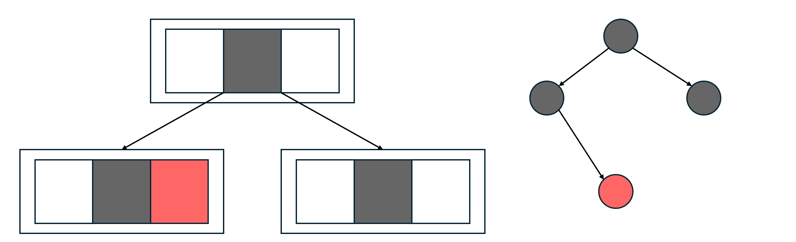

<div align="center">图1 rblr_r_fix</div>

对于RL的叔黑情况，与其等价的四阶B树的情况如下所示：


<div align="center">图1 rbrl</div>

对于叔黑的情况，修复结果如下所示：


<div align="center">图1 rbfix</div>

对于RL的叔红情况，与其等价的四阶B树的情况如下所示：


<div align="center">图1 rbrl_r</div>

上述修复情况如下所示：

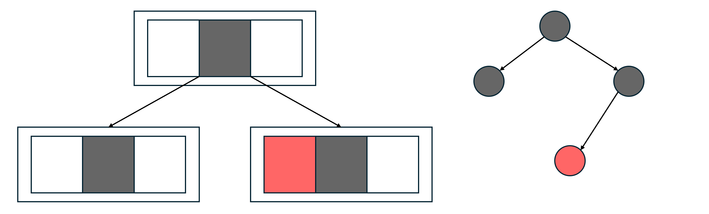

<div align="center">图1 rbrl_r_fix</div>

以上的八种情况都是一次修复，修复一层后，不平衡可能向上传递，所以while(TRUE)或递归是必要的，但在系统软件中最好是采用while(TRUE)的方式，这还是因为之前的系统栈溢出的问题，这里就不过多阐述了。

再说红黑树删除的实现，首先，按照二叉搜索树的删除用中序遍历后继补，然后再，具体对应关系如下：

以下是两种删除红色节点的情况：

对于红色实叶节点：

这种情况不管是删左右哪个红色实叶节点，直接删除即可，不会破坏四阶B树的平衡，一个较大的结构如下所示：

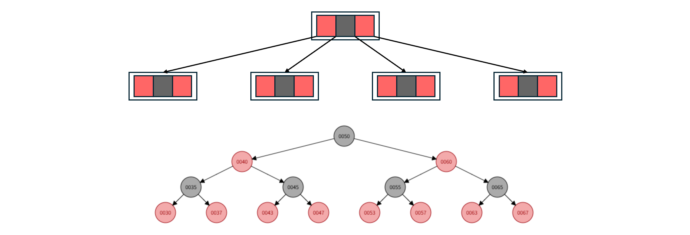

<div align="center">图1 full</div>

从上图等价的四阶B树可以看出：直接删红实叶节点，不会造成不平恒。

对于黑色实叶节点：


<div align="center">图1 rb_b_full</div>

从上图等价的四阶B树可以看出：直接删红实叶节点，会造成不平恒。

介绍了以上的两种基本情况，接下来，便可以讲完整的红黑树的删除了，红黑树的删除有两步：

1. 按照BST找到直接后继（找前驱也行，这里只实现了找后继，只找以删除节点为根的子树）
2. 根据直接后继的颜色对红黑树进行修复

根据以上的第一步，始终可以发现：找到的实际叶节点不是红色，就是黑色。如果找到的是红色，则用这个红叶节点，直接代替要被删除的节点。如果是黑色，我们一步步推导，最后得出一共有几种情况（这里，不要只看Linux源码，要自己推导，这样才能真的理解红黑树，另外，红黑树的删除中父节点的颜色在单层循环中是无意义的，只有在向上传导时，才有意义）。

首先，第一种大情况，最后找到的是黑色的叶子节点且其兄弟为黑色。<font color="#ff0000">在这种情况下，兄弟最多只能有一层孩子</font>，这是为什么？如下所示：


<div align="center">图1 remove_buddy_black_no</div>

不管是想要删除左黑子，还是右黑子，都会造成红黑树的不平衡。在限定条件兄弟为黑的条件下，原本的最小不平衡子树是平衡的，且一边是黑叶节点，对应另一边也一定黑高只有一。根据这个原因，可以有以下三种小情况：

**甲**、兄弟无孩子

用相同的图再来表示一次：


<div align="center">图1 remove_buddy_black_no</div>

这种情况下，请自行用手遮挡左孩子或右孩子用作删除节点，这时会发现：左右的黑高不一致，故最简单的修复方式就是将另一个黑色节点变为红色，合并到同一个四阶B树节点中，如下所示：


<div align="center">图1 remove_buddy_black_no_fix</div>

这样就保证了原本最小不平衡子树的平衡。

**乙**、兄弟有贴近自己一侧的孩子（这里只画出当实际被删除节点是左兄弟的情况）


<div align="center">图1 remove_buddy_black_closer</div>

以上两种其实是一种，都只看是否有近侄，对于远侄是不会处理的。有近侄就把近侄过继到被删节点即可（当然不能这样，因为这只是单纯从颜色看，真到操作的时候，还必须看值的大小，毕竟红黑树还是BST），这样就能保证黑高的相同。修复如下所示：


<div align="center">图1 remove_buddy_black_closer_fix</div>

这样就修复完了，其实就是将近侄先**右旋**再**左旋**（如果实际被删除节点是右孩子就先**左旋**再**右旋**）。

**丙**、兄弟无贴近自己一侧的孩子（这里只画出当实际被删除节点是左兄弟的情况）


<div align="center">图1 remove_buddy_black_far</div>

这里，删除黑色节点50，为了保证红黑树的平衡需要将节点60左旋，修复如下所示：


<div align="center">图1 remove_buddy_black_far_fix</div>

实现这个修复就是将60**左旋**（如果实际被删除节点是右孩子就**右旋**）。

最后，第二种大情况，最后找到的是黑色的叶子节点且其兄弟为红色。<font color="#ff0000">在这种情况下，兄弟最少有一层都满的黑孩子，最多只能有两层孩子</font>，这是为什么？如下所示：


<div align="center">图1 remove_buddy_red</div>

如果红兄弟但凡少一个黑孩子就会导致原本的红黑树黑高错误，在假设红黑树的构建完全无误的前提下，找到实际被删节点的兄弟为红色的前提下，起码的结构一定是这样。所以，上述的红字必然成立。

根据这个原因，可以有以下两种种小情况：

**甲**、两黑侄子无近侄孙（这里只画出当实际被删除节点是左兄弟的情况）

情况如下所示：


<div align="center">图1 remove_buddy_red_far</div>

修复如下所示：


<div align="center">图1 remove_buddy_red_far_fix</div>

实现以上的修复，就是将原本四阶B树父节点中的黑值放在无近侄孙对应的四阶B树节点中，对应的操作就是：将65左旋，然后将中间过程的60再左旋（如果实际被删除节点是右孩子就是两次不连贯的右旋）。

**乙**、两黑侄子有近侄孙（这里只画出当实际被删除节点是左兄弟的情况）

情况如下所示：


<div align="center">图1 remove_buddy_red_closer</div>

修复如下所示：


<div align="center">图1 remove_buddy_red_closer_fix</div>

实现以上的修复，就是将原四阶B树父节点的黑值补到实际被删除节点处，然后用最近侄孙补到原四阶B树父节点的黑值，对应的操作就是：将55右旋，再右旋，最后左旋（如果实际被删除节点是右孩子就是左旋、左旋，再右旋）。

红黑树的很多操作都是对称的，所以一个方向上的处理完，另一个方向上的问题一定是对称的。

到此，红黑树的删除也讲解完毕。

如果想要可视化查看各种数据结构链的关系，可以查看https://www.cs.usfca.edu/~galles/visualization/Algorithms.html。涉及到红黑树的删除部分，该网站采用的是找前驱，所以会有实现上的不一样。

###### 虚拟运行时间

权值表如下所示（直接采用Linux的权值表，有什么用之后再说）：

```c
const int sched_prio_to_weight[40] = {
    88761,
    71755,
    56483,
    46273,
    36291,
    29154,
    23254,
    18705,
    14949,
    11916,
    9548,
    7620,
    6100,
    4904,
    3906,
    3121,
    2501,
    1991,
    1586,
    1277,
    1024,
    820,
    655,
    526,
    423,
    335,
    272,
    215,
    172,
    137,
    110,
    87,
    70,
    56,
    45,
    36,
    29,
    23,
    18,
    15,
};
```

##### 任务状态段（TSS）

#### 文件系统

对于文件系统的硬件基础，本系统决定采用磁盘控制器DMA，这样，就可以避免CPU通过0x1f0端口每次取2字节而导致的CPU占用。

##### FAT32

对于FAT32文件系统的详细说明，可以参考附录中的微软（Microsoft）设计。

为什么要优先实现FAT32呢？因为：

1. FAT32的实现较为简单
2. BIOS下可以更加理解大小两个引导器的设计意义
3. U盘安装后的磁盘，需要被格式化为FAT32，UEFI会根据目录寻找EFI/BOOT/BOOTX64.EFI

###### FAT32结构体

首先，FAT32 Boot Sector结构体如下所示：

```c
#pragma pack(push, 1)
typedef struct fat32_bootsector {
    uint8_t  jump[3];           // 0x00: 跳转指令 (EB 58 90)
    uint8_t  oem[8];            // 0x03: OEM 名称 (如 "MSWIN4.1")
    uint16_t bytes_per_sector;  // 0x0B: 每扇区字节数 (通常 512)
    uint8_t  sectors_per_cluster; // 0x0D: 每簇扇区数 (1, 2, 4, 8, 16, 32, 64, 128)
    uint16_t reserved_sectors;  // 0x0E: 保留扇区数 (通常 32)
    uint8_t  num_fats;          // 0x10: FAT 表数量 (通常 2)
    uint16_t root_entries;      // 0x11: 根目录项数 (FAT32 中通常为 0)
    uint16_t total_sectors_16;  // 0x13: 总扇区数 (如果为 0，则用 total_sectors_32)
    uint8_t  media_descriptor;  // 0x15: 介质描述符 (0xF8 表示硬盘)
    uint16_t sectors_per_fat_16; // 0x16: 每个 FAT 表的扇区数 (FAT32 中通常为 0)
    uint16_t sectors_per_track; // 0x18: 每磁道扇区数
    uint16_t heads;             // 0x1A: 磁头数
    uint32_t hidden_sectors;    // 0x1C: 隐藏扇区数
    uint32_t total_sectors_32;  // 0x20: 总扇区数 (如果 total_sectors_16 == 0)
    uint32_t sectors_per_fat_32; // 0x24: 每个 FAT 表的扇区数 (关键)
    uint16_t extended_flags;    // 0x28: 扩展标志
    uint16_t fs_version;        // 0x2A: 文件系统版本 (0)
    uint32_t root_cluster;      // 0x2C: 根目录的起始簇号 (关键)
    uint16_t fs_info;           // 0x30: FSINFO 扇区号
    uint16_t backup_boot;       // 0x32: 备份引导扇区号
    uint8_t  reserved[12];      // 0x34: 保留
    uint8_t  drive_number;      // 0x40: 驱动器号
    uint8_t  reserved1;         // 0x41: 保留
    uint8_t  boot_signature;    // 0x42: 扩展引导签名 (0x29)
    uint32_t volume_id;         // 0x43: 卷序列号
    uint8_t  volume_label[11];  // 0x47: 卷标
    uint8_t  fs_type[8];        // 0x52: 文件系统类型 ("FAT32   ")
    uint8_t  code[420];         // 0x5A: 引导代码
    uint16_t signature;         // 0x1FE: 0xAA55
} fat32_bootsector_t;
#pragma pack(pop)
```

该结构体具体详见fatspec.pdf中P9~P13内容。文档里要求把这个东西放在磁盘的0扇区。这里，可以发现一个“矛盾”的现象：BIOS下，固件会读取0扇区入0x7c00，那我把上述的512字节写入0扇区，那不就是出问题了嘛。其实不是，可以看前三个字节0xE8、0x58、0x90：从当前地址跳转到 `当前地址 + 0x58 + 2`（因为 `EB` 和 `58` 占 2 字节，指令长度 3）。这样，直接能跳到code[420]执行。这就说明，BIOS下的boot.asm编译后不得超过420字节（就写一个loader.asm加载器得了，大引导器就可以“为所欲为”了）。

其次，FAT32 FSInfo结构体如下所示：

```c
#pragma pack(push, 1)
typedef struct fat32_fsinfo {
    uint32_t lead_signature;     // 0x41615252 ("RRaA")
    uint8_t  reserved1[480];     // 全 0
    uint32_t struct_signature;   // 0x61417272 ("rrAa")
    uint32_t free_count;         // 空闲簇数量（-1 = unknown）
    uint32_t next_free;          // 下一个可用簇（hint）
    uint8_t  reserved2[12];      // 全 0
    uint32_t trail_signature;   // 0xAA550000（注意低位0）
} fat32_fsinfo_t;
#pragma pack(pop)
```

上述的结构体不是必须存在的，也可以在系统运行时动态构建，是一个cache，但为了节省开销，本系统还是将其写入磁盘中，以便迅速定位到可用的簇。本系统将其放置在1号扇区。

而后，FAT32 Dir/File Entry结构体如下所示：

```c
#pragma pack(push, 1)
typedef struct fat32_dir_entry
{
    uint8_t name[8];            // 文件名（不足补空格，8 字节）
    uint8_t ext[3];             // 扩展名（不足补空格，3 字节）
    uint8_t attributes;         // 文件属性（见下）
    uint8_t reserved;           // 保留 (NT 用)
    uint8_t create_time_tenths; // 创建时间（厘秒）
    uint16_t create_time;       // 创建时间
    uint16_t create_date;       // 创建日期
    uint16_t access_date;       // 最后访问日期
    uint16_t cluster_high;      // 起始簇号高 16 位
    uint16_t modify_time;       // 修改时间
    uint16_t modify_date;       // 修改日期
    uint16_t cluster_low;       // 起始簇号低 16 位
    uint32_t file_size;         // 文件大小（字节）
} fat32_dir_entry_t;
#pragma pack(pop)
```

###### FAT32规范

上述的结构体就是如此，文件系统的磁盘划分如下所示：

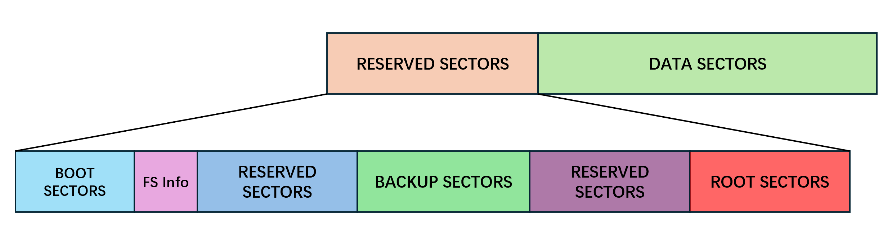

<div align="center">图1 文件系统磁盘划分</div>

规范中其实只说这些结构，并没有说如何去实现，以下便是作者自己的实现，估计不会兼容UEFI的，不过，后续一定会兼容的（如果，不兼容的话，那就没办法完成U盘安装系统的操作）。

###### FAT32实现

首先，要有一大堆的公式（也不算是公式，只不过要写成式子。这样，处理器才能“认识”文件系统），一个一个来吧（尽情享受吧）。

第一、`fat32_bootsector_t`有很多需要系统程序员自定义的字段（看心情写，只要逻辑没问题以及能实现），例如：`sectors_per_cluster`、`num_fats`。但，绝大多数的字段必须要“问问”磁盘控制器，让其“告知”磁盘的基本情况。具体流程如下所示：

```c
phys_addr read_identify_device(mmzone_t *zone)
{
    page_t *blk = alloc_pages(zone, 0);
    phys_addr addr = page2phys(zone, blk);
    setmem((void *)addr, 512, 0);
    uint16_t *read_addr = (uint16_t *)addr;
    out_byte_x64(LBA_MORE_DISK_PORT, 0xf0);
    delay_400ns();
    pre_send_command();
    send_identify_device_command();
    after_send_command();
    for (size_t i = 0; i < 256; i++, read_addr++)
    {
        uint16_t data = read_data();
        *read_addr = data;
    }
    free_pages(zone, blk);
    return addr;
}
```

这样就可以获取设备管理中的磁盘驱动中第一个结构体的全部值。为什么要固定从盘？这是因为这个代码是U盘上的内核要将文件系统安装在主磁盘上，这时候，U盘变为了主磁盘，而主磁盘变为了从磁盘。

第二、将上述代码中的相关信息复制在申请的内存中，如下所示：

```c
void fat32_fill_bootsectors(mmzone_t *zone)
{
    page_t *blk = alloc_pages(zone, 0);
    phys_addr blk_addr = page2phys(zone, blk);
    fat32_bootsector_t *fat32_boot = (fat32_bootsector_t *)blk_addr;
    fat32_boot->jump[0] = 0xeb;
    fat32_boot->jump[1] = 0x58;
    fat32_boot->jump[2] = 0x90;
    memcopy((void *)fat32_boot->oem, "GMOSDISK", 8);
    ata_identify_device_t *ata = (ata_identify_device_t *)read_identify_device((mmzone_t *)g_first_node->mmzone[2]);
    fat32_boot->bytes_per_sector = get_sector_bytes((phys_addr)ata);
    fat32_boot->sectors_per_cluster = 8; // 这里采用八块一簇 贴合内存分配最小粒度
    fat32_boot->reserved_sectors = 32;   // 一切计算的基准
    fat32_boot->num_fats = 1;
    fat32_boot->root_entries = 0;
    fat32_boot->total_sectors_16 = 0;
    fat32_boot->media_descriptor = 0xf8;
    fat32_boot->sectors_per_fat_16 = 0;
    fat32_boot->sectors_per_track = 0;
    fat32_boot->heads = 0;
    fat32_boot->hidden_sectors = 0;
    fat32_boot->total_sectors_32 = ata->lba28_sectors;
    fat32_boot->sectors_per_fat_32 = ata->lba28_sectors;
    fat32_boot->extended_flags = 0;
    fat32_boot->fs_version = 0;
    fat32_boot->root_cluster = 0;
    fat32_boot->fs_info = 0;
    fat32_boot->backup_boot = 0;
    fat32_boot->drive_number = 0;
    fat32_boot->boot_signature = 0x29;
    fat32_boot->volume_id = 0;
    memcopy((void *)fat32_boot->fs_type, "FAT32   ", 8);
    fat32_boot->signature = 0xaa55;
    write_lba28_sectors((void *)fat32_boot, 0, 1, LBA28_SLAVE_DISK);
    free_pages(zone, blk);
}
```

这只是个示范，具体的内容，请读者自行设计。将有用的数据复制到BootSectors后，便可以将该结构写入磁盘中。

第三、根据`total_sectors_32`等字段初始化FAT表，具体公式如下所示（一个簇号占4字节）：
$$
\begin{aligned}
clusters_{total} &= &sectors_{total}&/8 \\
size_{fat} &= &clusters_{total}&*4 \\
order_{fat} &= &GETORDER(size_{fat})
\end{aligned}
$$


#### 设备管理

##### 硬件端口

当作者还写前后端时，就根本没听过硬件端口，以至于刚听到硬件端口时，还以为像软件端口一样。但搞了之后才发现：其实硬件端口在某种程度上等价于嵌入式中的主控引脚，为什么可以直接操作，不用管时序的问题？那又得提到第二章中的“神仙”们，因为他们在电气层面，规范了时序，提供我们**in**和**out**这样的指令。

###### 固定端口

###### 内存映射端口（MMIO）

##### 磁盘驱动

下面的一段话，作者真不知道放在哪里更合适，所以，干脆在这里写了：

作者相信很多人都自己重装过系统吧，咱是不是要做启动盘（就那个U盘），U盘将系统等安装在主磁盘，所以，作者也是要做这样的。所以，在QEMU环境下，挂了两个磁盘，一个是FAT32格式的U盘，一个是完全干净的disk.img。用U盘中的EFI/BOOT/BOOTX64.EFI或之后的单独裸二进制来安装系统和挂载文件系统。为什么不用PCIe？因为作者真调不出来QEMU中的ACPI的MCFG表，没有这个，作者没办法拿到ECAM，就做不出现代化的设备驱动。所以，目前只能用PCI（DFS构建设备表）。作者也知道ECAM大概率在0xe00000这里，但要记住“大概率”这三个字。反正是没辙了，作者也自己编译了UEFI固件，也用`info qtree`查看过设备，还直接用了ubuntu自带的OVMF.fd，但都无法产生MCFG，所以，暂时放弃，等把手头上的事弄完了，再兼容PCIe。

之前，在文档中，作者聊到过CHS以及LBA方式。这里，直接讲LBA方式下获取基本信息的方式，基本信息结构体共512字节（固定），结构体如下所示：

```c
#pragma pack(push, 1)
typedef struct ata_identify_device
{
    uint16_t word0;
    uint16_t reserved1[9];    // 1-9
    uint16_t serial[10];      // 10-19
    uint16_t reserved2[3];    // 20-22
    uint16_t firmware[4];     // 23-26
    uint16_t model[20];       // 27-46
    uint16_t max_rw_sectors;  // 47
    uint16_t reserved48;      // 48
    uint16_t capabilities[2]; // 49-50
    uint16_t reserved3[9];    // 51-59
    uint32_t lba28_sectors;   // 60-61
    uint16_t reserved4[38];   // 62-99
    uint64_t lba48_sectors;   // 100-103
    uint16_t reserved5[152];  // 104-255
} ata_identify_device_t;
#pragma pack(pop)
```

在获取这512字节的信息前，要选择系统程序员想知道的磁盘，例如在间章中的QEMU环境搭建中的U盘和主磁盘，在安装操作系统时，需要用U盘安装（这是同主流系统一样的操作）。这里有一个规范：在写入被选择磁盘的号后，需要等待400ns后，再读512字节信息，如何延迟400ns，根据规范，有操作如下所示：

```c
in_byte(0x3f6);
in_byte(0x3f6);
in_byte(0x3f6);
in_byte(0x3f6);
```

你没看错，就是连着写四次in_byte，要不这样的话，读到的信息就极大概率是FAT32格式的启动盘的信息。

##### ACPI

ACPI的数据来源就是硬件检测后，由硬件写入内存的固定位置的，这个不是系统程序员能决定的。所以，程序员们只能根据入口进行树状搜索或者顺序地根据总览表到对应地址下比对签名，才能找到想要的配置表，例如：MCFG、FACP、APIC、SRAT等。ACPI树上的各个节点有统一的抽象结构如下所示：

```c
#pragma pack(push, 1)
typedef struct acpi_sdt_header
{
    char signature[4];         // 表签名，如 'RSDT', 'FACP'等
    uint32_t length;           // 表的长度（包括表头和地址表项，单位：字节）
    uint8_t revision;          // ACPI 修订版本
    uint8_t checksum;          // 整个表的校验和（和应为0）
    char oem_id[6];            // OEM ID
    char oem_table_id[8];      // OEM 表ID
    uint32_t oem_revision;     // OEM 修订版本
    char creator_id[4];        // 创建者ID
    uint32_t creator_revision; // 创建者修订版本
} acpi_sdt_header_t;
#pragma pack(pop)

#pragma pack(push, 1)
typedef struct unifed
{
    acpi_sdt_header_t header;
    uint8_t chars[]; // 可变长度数组，这里就取决于不同的配置表
} unifed_t;
#pragma pack(pop)
```

注意：必须要有**#pragma pack(push, 1)**和**#pragma pack(pop)**两个编译器特性或者**__attribute__((packed))**。前者如果在逻辑上未闭合，在其它引用该头文件时，会出现意想不到错误（别问作者怎么知道的）。至于各个配置表的结构，如果对源代码中的不信任，可以直接去找规范（作者也不信任自己代码里的，因为好多规范，本人也不知道该信哪一个）。

###### BIOS方式下ACPI入口查找

BIOS方式下，Intel规定了在0xe0000~0xfffff内查找，本系统使用了KMP算法在该范围内查找“RSD PTR ”这一签名（注意一共是8个字符，R后面还有一个空格字符0x20）。

###### UEFI方式下ACPI入口查找

UEFI方式下，本系统直接查找协议名**acpi_1_0_guid**或**acpi_2_0_guid**即可，这样，UEFI会返回入口。

##### PCI/PCIe

###### PCI

目前弄PCI的目的主要是为了使用ATA DMA，用于加快外存与内存交换的效率且提高CPU的利用率，PCI的配置空间结构体如下所示：

```c
typedef struct pci_configSpace
{
    // 0x00 ~ 0x0F 标准头部
    uint16_t vendor_id;      // 0x00
    uint16_t device_id;      // 0x02
    uint16_t command;        // 0x04
    uint16_t status;         // 0x06
    uint8_t revision_id;     // 0x08
    uint8_t prog_if;         // 0x09
    uint8_t subclass;        // 0x0A
    uint8_t class;           // 0x0B
    uint8_t cache_line_size; // 0x0C
    uint8_t latency_timer;   // 0x0D
    uint8_t header_type;     // 0x0E
    uint8_t bist;            // 0x0F

    // 0x10 ~ 0x3F 标准头扩展
    uint32_t bar[6];                // 0x10 ~ 0x27 (BAR0~BAR5)
    uint32_t cardbus_cis_ptr;       // 0x28
    uint16_t subsystem_vendor_id;   // 0x2C
    uint16_t subsystem_id;          // 0x2E
    uint32_t expansion_rom_base;    // 0x30
    uint8_t capabilities_ptr;       // 0x34
    uint8_t reserved1[3];           // 0x35 ~ 0x37
    uint32_t reserved2;             // 0x38 ~ 0x3B
    uint8_t interrupt_line;         // 0x3C
    uint8_t interrupt_pin;          // 0x3D
    uint16_t min_grant_max_latency; // 0x3E ~ 0x3F

    // 0x40 ~ 0xFF 设备扩展区（设备自定义 / 保留）
    uint8_t device_specific[192]; // 0x40 ~ 0xFF
} _packed pci_configSpace_t;
```

##### 显存驱动

首先，要声明的是：这部分有两节，分别是VGA的文本模式和图像模式，文本模式要讲的很少，图像模式就是天才的领域了。这里，作者不是天才，所以，只实现虚拟终端以及仿照川合秀实《30天自制操作系统》的图形化界面写一个差不多的桌面，另外，尽可能解决VTE留下的问题（当用UBUNTU的虚拟终端时，先收缩终端再扩大终端，就有bug了）。

###### 文本模式

这个应该是最简单的，直接向显存内写入ASCII码即可，拿一个便宜的东西举例子就是：嵌入式入门套件的LCD1602。（如果有需要，可以去https://www.bilibili.com/video/BV1Mb411e7re/?p=31，只是原理像，但实际还是有比较大的不同）。

VGA文本模式主要依赖两个硬件端口，如下所示：

```c
#define CRT_ADDR_REG 0x3d4
#define CRT_DATA_REG 0x3d5
```

VGA文本模式**CRT_ADDR_REG**比较有意义的配置寄存器如下所示：

```c
#define CRT_START_ADDR_H 0xc
#define CRT_START_ADDR_L 0xd
#define CRT_CURSOR_H 0xe
#define CRT_CURSOR_L 0xf
```

**CRT_START_ADDR**配置寄存器的作用更多的是指定显示的起始位置，具体效果如下所示（示意）：


<div align="center">图1 文本模式下console CRT_START_ADDR配置寄存器显示原理</div>

当**CRT_START_ADDR**配置寄存器内值被配置成向下一整行，便会出现“HELLO WORLD!!!”直接“消失”，下一行的“请输入文本”便会上浮。但之前的内容依旧存在缓冲区中。这里就要提出作者自己的疑问了：字符到底是几字节，我现在还没明白，一个字符背后有很多内容，到底是按什么标准算的，还是大家约定俗成的？

图像模式（全屏虚拟终端）

这里打算固定字符大小为16×8pixels（这是对于英文字符，汉字则是16×16pixels）且打算设置两个缓冲区，分别是：1、ASCII缓冲区；2、图像帧缓冲区。图像帧的填充通过ASCII缓冲区实时渲染。

实现全屏虚拟终端的过程，作者是这样认为的：

1. 先准备好字模（如果做过嵌入式入门0.96存屏幕字符显示，这方面应该很好理解，取模软件也会放在附录；如果想看嵌入式字符显示实现原理及实操的话，推荐去江协科技https://www.bilibili.com/video/BV1EN41177Pc）
2. 在VGA显存中画出第一个字符（多试几个或者直接画一个”HELLO WORLD!!!“，为了保障正确性）
3. 准备ASCII缓冲区（要从伙伴系统申请）
4. 实时渲染（将ASCII中的内容渲染在图像帧缓冲区）

至于图像帧缓冲区，可以直接用高地址映射的区域，也可以申请新的区域，新的区域中的内容则必须copy到高地址映射的区域，这样才能显示。

系统的其它设计为：先有一个进入桌面前的终端（是否进入桌面还要看使用者的心情），系统终端的结构体实例只有一个，系统认为是没有必要使用slab机制的，使用slab机制会申请至少三页的空间，所以，这里，直接给一页即可。这样，也可以做到各模块之间的解耦。系统还认为：在内存管理子系统建立后，一切皆可对象化。SystemGlobalConsole结构体如下所示：

```c
// 想象出来的
typedef struct
{
    uint64_t AllCharX;
    uint64_t AllCharY;
    uint64_t PerPixelCharWidth;
    uint64_t PerPixelCharHigth;
    uint64_t NowX;
    uint64_t NowY;
    uint64_t FrameBufferBase;
    uint64_t FrameBufferSize;
    uint64_t HorizontalResolution;
    uint64_t VerticalResolution;
    uint64_t PixelsPerScanLine;
    uint64_t PixelFormat;
} SystemGlobalConsole;
```

对于实现原理的总体设计如下所示：

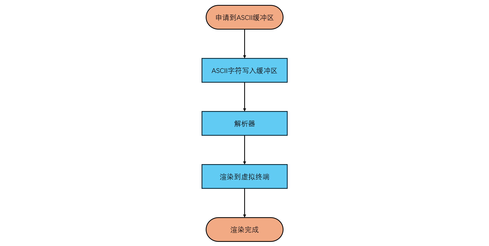

<div align="center">图1 渲染原理</div>

本系统设计ASCII缓冲区只存ASCII码，前景色与背景色则是单独设置的。

###### 图像模式（简陋桌面）

##### PIC

可编程中断控制器（PIC）相当于单片机中的EXTI，它的作用就是接收中断，产生中断向量。Intel 8259A中断控制器对应的硬件端口如下所示：

```c
#define HPCP 0x20
#define HPDP 0x21
#define SPCP 0xa0
#define SPDP 0xa1
```

需要向主从可编程中断控制器发送四个中断控制字的硬件端口如下所示：

```c
#define HICW1 0x20
#define HICW2 0x21
#define HICW3 0x21
#define HICW4 0x21

#define SICW1 0xa0
#define SICW2 0xa1
#define SICW3 0xa1
#define SICW4 0xa1
```

对于主从控制器，本系统采用的级联方式如下所示：

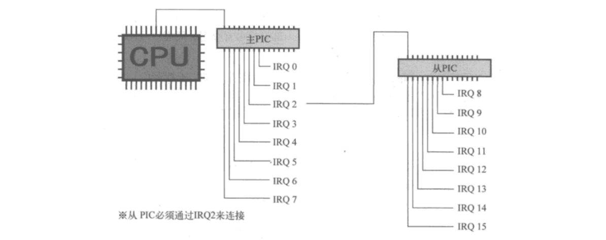

<div align="center">图1 PIC级联图</div>

上面那张图，是从川合秀实《30天自制操作系统》中粘过来的。主PIC的第一个中断IRQ0被设置为0x20，从PIC的第一个中断IRQ被设置为0x28，具体代码如下所示：

```c
void pic_init()
{
    out_byte(HIMR, 0xff);
    out_byte(SIMR, 0xff);

    out_byte(HICW1, 0x11);
    out_byte(HICW2, 0x20);
    out_byte(HICW3, 0x04);
    out_byte(HICW4, 0x01);

    out_byte(SICW1, 0x11);
    out_byte(SICW2, 0x28);
    out_byte(SICW3, 0x02);
    out_byte(SICW4, 0x01);
}
```

先给主从PIC发送中断屏蔽字0xff，所有中断全部屏蔽，这个中断屏蔽是对于中断控制器的，而不是对于CPU的，CPU的关中断是**sti**。

##### APIC

这里有人会问：为什么不把APIC和PIC一起讲呢？不都是可编程中断控制器吗？但作者想说：APIC与SMP的实现有关，并且作用机制有不一样，所以，作者这里分开写。

##### 键盘驱动

首先，先贴出三种不同的扫描码与ASCII码的对照表（全部用C语言表示），如下所示：

SET1：

```c
const uint8_t chr_set1_ascii[256] = {
    [0x01] = 0x1b, // ESC
    [0x02] = '1',  // 1 !
    [0x03] = '2',  // 2 @
    [0x04] = '3',  // 3 #
    [0x05] = '4',  // 4 $
    [0x06] = '5',  // 5 %
    [0x07] = '6',  // 6 ^
    [0x08] = '7',  // 7 &
    [0x09] = '8',  // 8 *
    [0x0a] = '9',  // 9 (
    [0x0b] = '0',  // 0 )
    [0x0c] = '-',  // - _
    [0x0d] = '=',  // = +
    [0x0e] = 0x08, // Backspace
    [0x0f] = 0x09, // Tab
    [0x10] = 'q',  // q Q
    [0x11] = 'w',  // w W
    [0x12] = 'e',  // e E
    [0x13] = 'r',  // r R
    [0x14] = 't',  // t T
    [0x15] = 'y',  // y Y
    [0x16] = 'u',  // u U
    [0x17] = 'i',  // i I
    [0x18] = 'o',  // o O
    [0x19] = 'p',  // p P
    [0x1a] = '[',  // [ {
    [0x1b] = ']',  // ] }
    [0x1c] = 0x0d, // Enter
    [0x1d] = 0xff, // Left Ctrl
    [0x1e] = 'a',  // a A
    [0x1f] = 's',  // s S
    [0x20] = 'd',  // d D
    [0x21] = 'f',  // f F
    [0x22] = 'g',  // g G
    [0x23] = 'h',  // h H
    [0x24] = 'j',  // j J
    [0x25] = 'k',  // k K
    [0x26] = 'l',  // l L
    [0x27] = ';',  // ; :
    [0x28] = 0x27, // ' "
    [0x29] = '`',  // ` ~
    [0x2a] = 0xff, // Left Shift
    [0x2b] = '\\', // \ |
    [0x2c] = 'z',  // z Z
    [0x2d] = 'x',  // x X
    [0x2e] = 'c',  // c C
    [0x2f] = 'v',  // v V
    [0x30] = 'b',  // b B
    [0x31] = 'n',  // n N
    [0x32] = 'm',  // m M
    [0x33] = ',',  // , <
    [0x34] = '.',  // . >
    [0x35] = '/',  // / ?
    [0x36] = 0xff, // Right Shift
    [0x37] = '*',  // * (小键盘)
    [0x38] = 0xff, // Left Alt
    [0x39] = ' ',  // Space
    [0x3a] = 0xff, // Caps Lock
    [0x3b] = 0xff, // F1
    [0x3c] = 0xff, // F2
    [0x3d] = 0xff, // F3
    [0x3e] = 0xff, // F4
    [0x3f] = 0xff, // F5
    [0x40] = 0xff, // F6
    [0x41] = 0xff, // F7
    [0x42] = 0xff, // F8
    [0x43] = 0xff, // F9
    [0x44] = 0xff, // F10
    [0x45] = 0xff, // Num Lock
    [0x46] = 0xff, // Scroll Lock
    [0x47] = '7',  // Home / 7
    [0x48] = '8',  // ↑ / 8
    [0x49] = '9',  // Page Up / 9
    [0x4a] = '-',  // - (小键盘)
    [0x4b] = '4',  // ← / 4
    [0x4c] = '5',  // 5
    [0x4d] = '6',  // → / 6
    [0x4e] = '+',  // + (小键盘)
    [0x4f] = '1',  // End / 1
    [0x50] = '2',  // ↓ / 2
    [0x51] = '3',  // Page Down / 3
    [0x52] = '0',  // Ins / 0
    [0x53] = '.',  // Del / .
    [0x57] = 0xff, // F11
    [0x58] = 0xff, // F12
    [0xe0] = 0xff, // E0前缀 (Print Screen / Pause等扩展键)
};
```

SET2：

```c
const uint8_t chr_set2_ascii[256] = {
    [0x01] = 0xff, // F9
    [0x03] = 0xff, // F5
    [0x04] = 0xff, // F3
    [0x05] = 0xff, // F1
    [0x06] = 0xff, // F2
    [0x07] = 0xff, // F12
    [0x09] = 0xff, // F10
    [0x0a] = 0xff, // F8
    [0x0b] = 0xff, // F6
    [0x0c] = 0xff, // F4
    [0x0d] = 0x09, // Tab
    [0x0e] = '`',  // ` ~
    [0x11] = 0xff, // Left Alt
    [0x12] = 0xff, // Left Shift
    [0x14] = 0xff, // Left Ctrl
    [0x15] = 'q',  // q Q
    [0x16] = '1',  // 1 !
    [0x1a] = 'z',  // z Z
    [0x1b] = 's',  // s S
    [0x1c] = 'a',  // a A
    [0x1d] = 'w',  // w W
    [0x1e] = '2',  // 2 @
    [0x21] = 'c',  // c C
    [0x22] = 'x',  // x X
    [0x23] = 'd',  // d D
    [0x24] = 'e',  // e E
    [0x25] = '4',  // 4 $
    [0x26] = '3',  // 3 #
    [0x29] = 0x20, // Space
    [0x2a] = 'v',  // v V
    [0x2b] = 'f',  // f F
    [0x2c] = 't',  // t T
    [0x2d] = 'r',  // r R
    [0x2e] = '5',  // 5 %
    [0x31] = 'n',  // n N
    [0x32] = 'b',  // b B
    [0x33] = 'h',  // h H
    [0x34] = 'g',  // g G
    [0x35] = 'y',  // y Y
    [0x36] = '6',  // 6 ^
    [0x3a] = 'm',  // m M
    [0x3b] = 'j',  // j J
    [0x3c] = 'u',  // u U
    [0x3d] = '7',  // 7 &
    [0x3e] = '8',  // 8 *
    [0x41] = ',',  // , <
    [0x42] = 'k',  // k K
    [0x43] = 'i',  // i I
    [0x44] = 'o',  // o O
    [0x45] = '0',  // 0 )
    [0x46] = '9',  // 9 (
    [0x49] = '.',  // . >
    [0x4a] = '/',  // / ?
    [0x4b] = 'l',  // l L
    [0x4c] = ';',  // ; :
    [0x4d] = 'p',  // p P
    [0x4e] = '-',  // - _
    [0x52] = 0x27, // ' "
    [0x54] = '[',  // [ {
    [0x55] = '=',  // = +
    [0x58] = 0xff, // Caps Lock
    [0x59] = 0xff, // Right Shift
    [0x5a] = 0x0d, // Enter
    [0x5b] = ']',  // ] }
    [0x5d] = '\\', // \ |
    [0x66] = 0x08, // Backspace
    [0x69] = '1',  // End / 1
    [0x6b] = '4',  // ← / 4
    [0x6c] = '7',  // Home / 7
    [0x70] = '0',  // Ins / 0
    [0x71] = '.',  // Del / .
    [0x72] = '2',  // ↓ / 2
    [0x73] = '5',  // 5
    [0x74] = '6',  // → / 6
    [0x75] = '8',  // ↑ / 8
    [0x76] = 0x1b, // ESC
    [0x77] = 0xff, // Num Lock
    [0x78] = 0xff, // F11
    [0x79] = '+',  // +
    [0x7a] = '3',  // Page Down / 3
    [0x7b] = '-',  // -
    [0x7c] = '*',  // *
    [0x7d] = '9',  // Page Up / 9
    [0x83] = 0xff, // F7
    [0xe0] = 0xff, // E0扩展键前缀
    [0xe1] = 0xff, // E1扩展键前缀 (Pause)
    [0xf0] = 0xff, // 断码前缀
};
```

SET3：

```c
const uint8_t chr_set3_ascii[256] = {
    [0x01] = 0xff, // 未知键
    [0x02] = '1',  // 1 !
    [0x03] = '2',  // 2 @
    [0x04] = '3',  // 3 #
    [0x05] = '4',  // 4 $
    [0x06] = '5',  // 5 %
    [0x07] = '6',  // 6 ^
    [0x08] = 0x1b, // ESC
    [0x09] = '7',  // 7 &
    [0x0a] = '8',  // 8 *
    [0x0b] = '9',  // 9 (
    [0x0c] = '0',  // 0 )
    [0x0d] = '-',  // - _
    [0x0e] = '=',  // = +
    [0x0f] = 0x08, // Backspace
    [0x10] = 0x09, // Tab
    [0x11] = 'q',  // q Q
    [0x12] = 'w',  // w W
    [0x13] = 'e',  // e E
    [0x14] = 'r',  // r R
    [0x15] = 't',  // t T
    [0x16] = 'y',  // y Y
    [0x17] = 'u',  // u U
    [0x18] = 'i',  // i I
    [0x19] = 'o',  // o O
    [0x1a] = 'p',  // p P
    [0x1b] = '[',  // [ {
    [0x1c] = ']',  // ] }
    [0x1d] = 0x0d, // Enter
    [0x1e] = 0xff, // Left Ctrl
    [0x1f] = 'a',  // a A
    [0x20] = 's',  // s S
    [0x21] = 'd',  // d D
    [0x22] = 'f',  // f F
    [0x23] = 'g',  // g G
    [0x24] = 'h',  // h H
    [0x25] = 'j',  // j J
    [0x26] = 'k',  // k K
    [0x27] = 'l',  // l L
    [0x28] = ';',  // ; :
    [0x29] = 0x27, // ' "
    [0x2a] = '`',  // ` ~
    [0x2b] = 0xff, // Left Shift
    [0x2c] = '\\', // \ |
    [0x2d] = 'z',  // z Z
    [0x2e] = 'x',  // x X
    [0x2f] = 'c',  // c C
    [0x30] = 'v',  // v V
    [0x31] = 'b',  // b B
    [0x32] = 'n',  // n N
    [0x33] = 'm',  // m M
    [0x34] = ',',  // , <
    [0x35] = '.',  // . >
    [0x36] = '/',  // / ?
    [0x37] = 0xff, // Right Shift
    [0x38] = 0xff, // Left Alt
    [0x39] = ' ',  // Space
    [0x3a] = 0xff, // Caps Lock
    [0x3b] = 0xff, // F1
    [0x3c] = 0xff, // F2
    [0x3d] = 0xff, // F3
    [0x3e] = 0xff, // F4
    [0x3f] = 0xff, // F5
    [0x40] = 0xff, // F6
    [0x41] = 0xff, // F7
    [0x42] = 0xff, // F8
    [0x43] = 0xff, // F9
    [0x44] = 0xff, // F10
    [0x45] = 0xff, // Num Lock
    [0x46] = 0xff, // Scroll Lock
    [0x47] = '7',  // Home / 7
    [0x48] = '8',  // ↑ / 8
    [0x49] = '9',  // Page Up / 9
    [0x4a] = '-',  // - (小键盘)
    [0x4b] = '4',  // ← / 4
    [0x4c] = '5',  // 5
    [0x4d] = '6',  // → / 6
    [0x4e] = '+',  // + (小键盘)
    [0x4f] = '1',  // End / 1
    [0x50] = '2',  // ↓ / 2
    [0x51] = '3',  // Page Down / 3
    [0x52] = '0',  // Ins / 0
    [0x53] = '.',  // Del / .
    [0x54] = 0xff, // 未知键
    [0x55] = '*',  // * (小键盘)
    [0x56] = 0xff, // F11
    [0x57] = 0xff, // F12
    [0x58] = 0xff, // Left GUI
    [0x59] = 0xff, // Right GUI
    [0x5a] = 0xff, // App (Menu键)
    [0x5b] = 0xff, // Right Alt
    [0x5c] = 0xff, // Right Ctrl
    [0x5d] = 0xff, // 未知键
    [0x5e] = 0xff, // 未知键
    [0x5f] = 0xff, // 未知键
    [0x60] = 0xff, // 未知键
    [0x61] = 0xff, // 未知键
    [0x62] = 0xff, // 未知键
    [0x63] = 0xff, // 未知键
    [0x64] = 0xff, // 未知键
    [0x65] = 0xff, // 未知键
    [0x66] = 0x08, // Backspace (重复)
    [0x67] = 0xff, // 未知键
    [0x68] = 0xff, // 未知键
    [0x69] = '1',  // End / 1 (重复)
    [0x6a] = 0xff, // 未知键
    [0x6b] = '4',  // ← / 4 (重复)
    [0x6c] = '7',  // Home / 7 (重复)
    [0x6d] = 0xff, // 未知键
    [0x6e] = 0xff, // 未知键
    [0x6f] = 0xff, // 未知键
    [0x70] = '0',  // Ins / 0 (重复)
    [0x71] = '.',  // Del / . (重复)
    [0x72] = '2',  // ↓ / 2 (重复)
    [0x73] = '5',  // 5 (重复)
    [0x74] = '6',  // → / 6 (重复)
    [0x75] = '8',  // ↑ / 8 (重复)
    [0x76] = 0xff, // 未知键
    [0x77] = 0xff, // 未知键
    [0x78] = 0xff, // 未知键
    [0x79] = '+',  // + (重复)
    [0x7a] = '3',  // Page Down / 3 (重复)
    [0x7b] = '-',  // - (重复)
    [0x7c] = '*',  // * (重复)
    [0x7d] = '9',  // Page Up / 9 (重复)
    [0x7e] = 0xff, // 未知键
    [0x7f] = 0xff, // 未知键
    [0x84] = 0xff, // 打印/系统请求
    [0x85] = 0xff, // 未知键
    [0x86] = 0xff, // 未知键
    [0x87] = 0xff, // 未知键
};
```

#### 系统中断

##### 中断描述符表（IDT）

###### 加载IDTR

在重构的系统中，本系统采用了如下所示的结构体，该结构体同时适合x86以及x64的需要：

```c
#pragma pack(push, 1)
typedef struct x86_64_idtr
{
    uint16_t limit;
    union
    {
        struct
        {
            uint32_t base;
            uint32_t reserved;
        } x86_base;
        uint64_t x64_base;
    } base;
} x86_64_idtr_t;
#pragma pack(pop)
```

这是为什么能同时适合呢？因为**lidt**指令在不同的模式下，加载的位数是有限的，在保护模式下，仅仅加载首地址后的48位；而在长模式下，加载首地址后的80位。而上述结构体在栈中一次性申请80位也是合理的。

###### 填充IDTE

不论是x86，还是x64，IDT都有256项，IDT表项结构体如下所示（x86及x64）：

```c
#pragma pack(push, 1)
typedef struct x86_idt_desc
{
    uint16_t low_offset;
    uint16_t selector;
    uint8_t reserved;
    uint8_t TYPE : 4;
    uint8_t S : 1;
    uint8_t DPL : 2;
    uint8_t P : 1;
    uint16_t high_offset;
} x86_idt_desc_t;
#pragma pack(pop)

#pragma pack(push, 1)
typedef struct x64_idt_desc
{
    uint16_t low_offset; // 偏移 0-15 位
    uint16_t selector;   // 段选择子
    uint8_t ist;         // 中断栈表 (Interrupt Stack Table) 偏移，低3位有效
    uint8_t TYPE : 4;
    uint8_t S : 1;
    uint8_t DPL : 2;
    uint8_t P : 1;
    uint16_t mid_offset;  // 偏移 16-31 位
    uint32_t high_offset; // 偏移 32-63 位
    uint32_t reserved;    //  保留，必须为0
} x64_idt_desc_t;
#pragma pack(pop)
```

对于中断服务例程，本系统在之前的版本中采用了手动保存现场的做法，具体如下所示（以键盘中断为例）：

```assembly
_int_0x21:
    pushad
    call kb_handler
    popad
    iret
```

上述代码中的**pushad**及**popad**都是x86下的常用，但系统在重构后，目前仅支持64位，就不采用上述保存现场的方式，而采用如下所示的特性：

```c
__attribute__((interrupt)) void keyboard_handler(struct interrupt_frame *frame)
{
#if defined(__i386__)

#elif defined(__x86_64__)

#endif
}
```

上述代码中的__attribute\_\_((interrupt))是GNU GCC的特性，可以帮助程序员保存信息，但需要设有专门的interrupt_frame用于接收信息，interrupt_frame结构体如下所示（必须这么写，这是硬件与编译器同时规定的）：

```c
struct interrupt_frame
{
    uint64_t rip;
    uint64_t cs;
    uint64_t rflags;
    uint64_t rsp;
    uint64_t ss;
};
```

中断服务例程的本质就是一个函数，总的来说，工作原理就是如下的步骤：

1. 将程序员编写的中断服务例程的地址写入对应的中断号的IDT表项中
2. 当中断控制器收到中断向量，保存恢复地址
3. 根据这个向量找到对应的IDT表项，跳转
4. 执行完中断服务例程，恢复现场，到中断的下一条执行

教材里的过程是没有错误的，只是太简化了，没有细节。还有，中断向量就是一个偏移值，作者不明白为什么这么多专业术语，就是在IDTR的首地址中加偏移值就能找到对应的IDTE。之后的系统调用的实现，也是要借助系统中断去实现的。

#### 系统调用

## 关于游戏开发部的声明

<div align="center">

</img>
</br>
图6 游戏开发部logo
</div>
写文档的时候，一直在听王小桃唱歌，就把王小桃贴上来，看文档的人呀，如果想的话，可以边听小桃唱歌，边看文档写代码。链接：
https://space.bilibili.com/3284752
入坑BA也是才羽桃井的原因，或许她真的能成为**游戏王**。